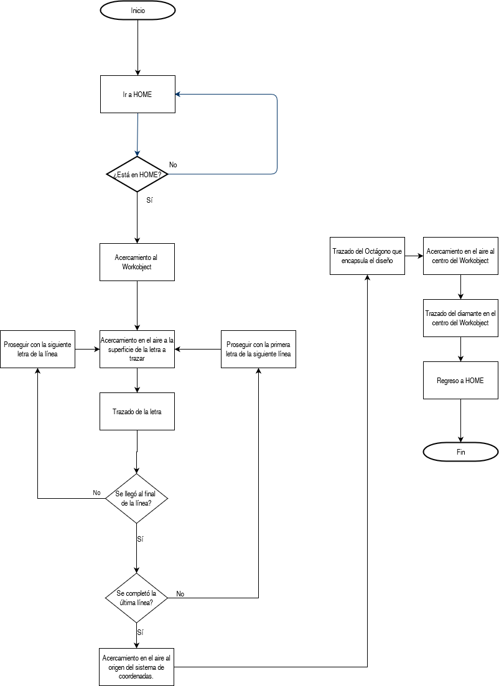

# Carlos Felipe Sánchez & Felipe Cruz
# Universidad Nacional de Colombia
# Robótica - 2023-II
# Laboratorio 1


# Contenido
En el repositorio de este laboratorio se encuentra lo siguiente:
- README.md -> Archivo base con la descripción del laboratorio.
- CAD -> Carpeta que contiene los modelos 3D de la herramienta diseñada en formatos .ipt, .iam, .stl, .step.
- RobotStudio -> Carpeta que contiene la solución de Robot Studio utilizada durante la práctica.
- Imgs -> Carpeta con imágenes utilizadas en el archivo README.
- Videos -> Carpeta con los videos resultantes del desarrollo de la práctica.

---
Tabla de Contenidos
---

- [1. Diseño de la herramienta](#1-diseño-de-la-herramienta)
- [2. Diseño de la figura a dibujar con el robot](#2-diseño-de-la-figura-a-dibujar-con-el-robot)
- [3. Incorporación de la herramienta dentro de RobotStudio](#3-incorporación-de-la-herramienta-dentro-de-robotstudio)
- [4. Diseño de la trayectoria](#4-diseño-de-la-trayectoria)
- [5. Programación en RAPID de la trayectoria](#5-programación-en-rapid-de-la-trayectoria)
- [6. Simulación del movimiento del robot en Robot Studio](#6-simulación-del-movimiento-del-robot-en-robot-studio)
- [7. Ubicación real de los elementos](#7-ubicación-real-de-los-elementos)
- [8. Implementación de la solución en los robots reales](#8-implementación-de-la-solución-en-los-robots-reales)


La solución planteada se desarrolló siguiendo los siguientes pasos. En cada uno de los siguientes pasos se describe en detalle lo realizado.
# 1. Diseño de la herramienta.
La herramienta del proceso corresponde a un marcador para escribir sobre papel. El diseño corresponde al diseño de un soporte que conecte el marcador con el flange del robot.

El diseño tuvo en consideración lo siguiente:
- El tamaño y forma del flange del robot real. El tamaño del flange y el tamaño y ubicación de los agujeros se obtiene del datasheet del robot en la página 61.


*Fig1.1: Plano del flange del robot. (Datasheet, pp 61).*

- El diámetro aproximado del marcador real a utilizar.
- La herramienta debe estar apoyada sobre el plano xy con el eje z hacia arriba (para facilitar la incorporación de esta dentro de RobotStudio).
- Colocación de un resorte para darle tolerancia al movimiento del robot.
- La punta del marcador no debe quedar alineada con el eje z ya que incrementa la probabilidad de que se presenten singularidades durante el movimiento del robot.

Teniendo en cuenta lo anterior, se realiza el diseño del soporte y el marcador en AutoDesk Inventor 2023. El resultado es el siguiente:


*Fig1.2: Soporte diseñado en Inventor. Note que la base se encuentra sobre el plano xy y la punta no se alinea con el eje z.*


*Fig1.3: Herramienta diseñada y ensamblada en Inventor.*

Posteriormente, se utiliza la impresión 3D para manufacturar el soporte del marcador en PLA. Se utiliza un resorte común y silicona para obtener la herramienta final:


*Fig1.4: Herramienta final.*

# 2. Diseño de la figura a dibujar con el robot.
Se optó por un diseño con las letras FELIC en la linea superior, CFSDZ en la línea inferior, un octágono que las rodeara, y un diamante en el centro, el rectángulo corresponde al área de trabajo definida para el work object del robot.


# 3. Incorporación de la herramienta dentro de RobotStudio.
Pasos de la incorporación:
1. El ensamble de la herramienta se exporta en formato .STEP.
2. Se importa el archivo en Robot Studio en "Importar geometría".
3. Se define un sistema de coordenadas sobre la punta de la herramienta con el eje z alineado al marcador.
4. Se crea la herramienta **Marcador** con la geometría y sistema coordenado definidos anteriormente.
5. Se asocia la herramienta con el manipulador de tal manera que la herramienta quede sobre el flange (articulación 6).


*Fig3.1: Herramienta definida en RobotStudio con su TCP.*


*Fig3.2: Herramienta ensamblada con el manipulador en RobotStudio.*

# 4. Diseño de la trayectoria
Para el diseño de la trayectoria, se establece un sistema coordenado para el WorkObject, el cual será la base para definir la trayectoria.
La trayectoria sigue la lógica del siguiente diagrama de flujo:


# 5. Programación en RAPID de la trayectoria.
Para la programación en RAPID de la trayectoria se utilizaron 3 tipos de dato: *tooldata*, *wobjdata*, y *robtarget*.

Los dos primeros se definen al momento de la calibración y por tanto varían dependiendo de dónde se coloquen los elementos en la vida real.

Los elementos del tipo *robtarget* si fueron definidos por nosotros uno por uno. Teniendo en cuenta el diseño mostrado en la sección 2, definimos cada uno de los puntos del diseño con coordenadas (x,y,0). Además, para cada letra colocamos un punto en z = 50 para que el robot se acerque antes de escribir y evitar singularidades o rayones inesperados. También, se definió la dirección deseada para cada uno de los puntos que corresponde al marcador perpendicular al plano de escritura, es decir, el TCP del marcador debe tener el eje z en dirección al plano y perpendicular a este.

Los datos del tipo *robtarget* se definen de la siguiente manera:
```
    CONST robtarget Target_Nombre:=[[x, y, z],[q1, q2, q3, q4],...];
```
Para que la orientación sea como la buscamos, se debe colocar [q1, q2, q3, q4] = [0, 0, 1, 0].

Luego, ya con los puntos definidos, creamos el path utilizando el comando *MoveJ*. El path lo definimos con los puntos definidos intentando que el marcador no esciribiera dos veces sobre la misma zona, y de tal manera que antes y después de escribir una letra se devolviera al punto de la letra con z = 50 antes de pasar a dibujar la siguiente letra.

No utilizamos *MoveL* ya que se generaban bastantes singularidades.

El comando *MoveJ* se define de la siguiente manera:
```
    MoveJ Target_Nombre,velocidad,precisiòn,Herramienta\WObj:=WO_Nombre;
```
Utilizamos en todo momento una velocidad **z100**, para alcanzar a detener el robot en vida real en caso de algún movimiento erróneo; una precisión **fine**, para que la trayectoria descrita sea seguida por el robot de manera exacta; la herramienta **Marcador** definida en la sección 3; y el WorkObject **WO_Pastel**, para los puntos de la trayectoria. Por otra parte, también definimos el **Home** del robot respecto al **wobj0** en la posición donde todas las articulaciones están en 0 grados.

El código final se presenta a continuación:
```
MODULE Module1
        PERS tooldata Marcador:=[TRUE,[[25.287,0,146.409],[0.996194698,0,0.087155743,0]],[0.1,[0,0,1],[1,0,0,0],0,0,0]];
    TASK PERS wobjdata WO_Pastel:=[FALSE,TRUE,"",[[833.258893819,68.374306775,269.142643333],[0,-0.000000001,0,1]],[[0,0,0],[1,0,0,0]]];
    CONST robtarget Target_F0:=[[50,30,50],[0,0,1,0],[0,0,0,0],[9E+09,9E+09,9E+09,9E+09,9E+09,9E+09]];
    CONST robtarget Target_F1:=[[20,20,0],[0,0,1,0],[0,0,0,0],[9E+09,9E+09,9E+09,9E+09,9E+09,9E+09]];
    CONST robtarget Target_F2:=[[20,40,0],[0,0,1,0],[0,0,0,0],[9E+09,9E+09,9E+09,9E+09,9E+09,9E+09]];
    CONST robtarget Target_F3:=[[40,20,0],[0,0,1,0],[0,0,0,0],[9E+09,9E+09,9E+09,9E+09,9E+09,9E+09]];
    CONST robtarget Target_F4:=[[40,30,0],[0,0,1,0],[0,0,0,0],[9E+09,9E+09,9E+09,9E+09,9E+09,9E+09]];
    CONST robtarget Target_F5:=[[80,20,0],[0,0,1,0],[0,0,0,0],[9E+09,9E+09,9E+09,9E+09,9E+09,9E+09]];
    CONST robtarget Target_E0:=[[50,60,50],[0,0,1,0],[0,0,0,0],[9E+09,9E+09,9E+09,9E+09,9E+09,9E+09]];
    CONST robtarget Target_E1:=[[20,50,0],[0,0,1,0],[0,0,0,0],[9E+09,9E+09,9E+09,9E+09,9E+09,9E+09]];
    CONST robtarget Target_E2:=[[20,70,0],[0,0,1,0],[0,0,0,0],[9E+09,9E+09,9E+09,9E+09,9E+09,9E+09]];
    CONST robtarget Target_E3:=[[50,50,0],[0,0,1,0],[0,0,0,0],[9E+09,9E+09,9E+09,9E+09,9E+09,9E+09]];
    CONST robtarget Target_E4:=[[50,60,0],[0,0,1,0],[0,0,0,0],[9E+09,9E+09,9E+09,9E+09,9E+09,9E+09]];
    CONST robtarget Target_E5:=[[80,50,0],[0,0,1,0],[0,0,0,0],[9E+09,9E+09,9E+09,9E+09,9E+09,9E+09]];
    CONST robtarget Target_E6:=[[80,70,0],[0,0,1,0],[0,0,0,0],[9E+09,9E+09,9E+09,9E+09,9E+09,9E+09]];
    CONST robtarget Target_L0:=[[50,90,50],[0,0,1,0],[0,0,0,0],[9E+09,9E+09,9E+09,9E+09,9E+09,9E+09]];
    CONST robtarget Target_L1:=[[20,80,0],[0,0,1,0],[0,0,0,0],[9E+09,9E+09,9E+09,9E+09,9E+09,9E+09]];
    CONST robtarget Target_L2:=[[80,80,0],[0,0,1,0],[0,0,0,0],[9E+09,9E+09,9E+09,9E+09,9E+09,9E+09]];
    CONST robtarget Target_L3:=[[80,100,0],[0,0,1,0],[0,0,0,0],[9E+09,9E+09,9E+09,9E+09,9E+09,9E+09]];
    CONST robtarget Target_I0:=[[50,120,50],[0,0,1,0],[0,0,0,0],[9E+09,9E+09,9E+09,9E+09,9E+09,9E+09]];
    CONST robtarget Target_I1:=[[20,110,0],[0,0,1,0],[0,0,0,0],[9E+09,9E+09,9E+09,9E+09,9E+09,9E+09]];
    CONST robtarget Target_I2:=[[20,120,0],[0,0,1,0],[0,0,0,0],[9E+09,9E+09,9E+09,9E+09,9E+09,9E+09]];
    CONST robtarget Target_I3:=[[20,130,0],[0,0,1,0],[0,0,0,0],[9E+09,9E+09,9E+09,9E+09,9E+09,9E+09]];
    CONST robtarget Target_I4:=[[80,110,0],[0,0,1,0],[0,0,0,0],[9E+09,9E+09,9E+09,9E+09,9E+09,9E+09]];
    CONST robtarget Target_I5:=[[80,120,0],[0,0,1,0],[0,0,0,0],[9E+09,9E+09,9E+09,9E+09,9E+09,9E+09]];
    CONST robtarget Target_I6:=[[80,130,0],[0,0,1,0],[0,0,0,0],[9E+09,9E+09,9E+09,9E+09,9E+09,9E+09]];
    CONST robtarget Target_C0:=[[50,150,50],[0,0,1,0],[0,0,0,0],[9E+09,9E+09,9E+09,9E+09,9E+09,9E+09]];
    CONST robtarget Target_C1:=[[20,140,0],[0,0,1,0],[0,0,0,0],[9E+09,9E+09,9E+09,9E+09,9E+09,9E+09]];
    CONST robtarget Target_C2:=[[20,160,0],[0,0,1,0],[0,0,0,0],[9E+09,9E+09,9E+09,9E+09,9E+09,9E+09]];
    CONST robtarget Target_C3:=[[80,140,0],[0,0,1,0],[0,0,0,0],[9E+09,9E+09,9E+09,9E+09,9E+09,9E+09]];
    CONST robtarget Target_C4:=[[80,160,0],[0,0,1,0],[0,0,0,0],[9E+09,9E+09,9E+09,9E+09,9E+09,9E+09]];
    CONST robtarget Target_2C0:=[[130,30,50],[0,0,1,0],[0,0,0,0],[9E+09,9E+09,9E+09,9E+09,9E+09,9E+09]];
    CONST robtarget Target_2C1:=[[100,20,0],[0,0,1,0],[0,0,0,0],[9E+09,9E+09,9E+09,9E+09,9E+09,9E+09]];
    CONST robtarget Target_2C2:=[[100,40,0],[0,0,1,0],[0,0,0,0],[9E+09,9E+09,9E+09,9E+09,9E+09,9E+09]];
    CONST robtarget Target_2C3:=[[160,20,0],[0,0,1,0],[0,0,0,0],[9E+09,9E+09,9E+09,9E+09,9E+09,9E+09]];
    CONST robtarget Target_2C4:=[[160,40,0],[0,0,1,0],[0,0,0,0],[9E+09,9E+09,9E+09,9E+09,9E+09,9E+09]];
    CONST robtarget Target_2F0:=[[130,60,50],[0,0,1,0],[0,0,0,0],[9E+09,9E+09,9E+09,9E+09,9E+09,9E+09]];
    CONST robtarget Target_2F1:=[[100,50,0],[0,0,1,0],[0,0,0,0],[9E+09,9E+09,9E+09,9E+09,9E+09,9E+09]];
    CONST robtarget Target_2F2:=[[100,70,0],[0,0,1,0],[0,0,0,0],[9E+09,9E+09,9E+09,9E+09,9E+09,9E+09]];
    CONST robtarget Target_2F3:=[[120,50,0],[0,0,1,0],[0,0,0,0],[9E+09,9E+09,9E+09,9E+09,9E+09,9E+09]];
    CONST robtarget Target_2F4:=[[120,60,0],[0,0,1,0],[0,0,0,0],[9E+09,9E+09,9E+09,9E+09,9E+09,9E+09]];
    CONST robtarget Target_2F5:=[[160,50,0],[0,0,1,0],[0,0,0,0],[9E+09,9E+09,9E+09,9E+09,9E+09,9E+09]];
    CONST robtarget Target_2S0:=[[130,90,50],[0,0,1,0],[0,0,0,0],[9E+09,9E+09,9E+09,9E+09,9E+09,9E+09]];
    CONST robtarget Target_2S1:=[[100,80,0],[0,0,1,0],[0,0,0,0],[9E+09,9E+09,9E+09,9E+09,9E+09,9E+09]];
    CONST robtarget Target_2S2:=[[100,100,0],[0,0,1,0],[0,0,0,0],[9E+09,9E+09,9E+09,9E+09,9E+09,9E+09]];
    CONST robtarget Target_2S3:=[[130,80,0],[0,0,1,0],[0,0,0,0],[9E+09,9E+09,9E+09,9E+09,9E+09,9E+09]];
    CONST robtarget Target_2S4:=[[130,100,0],[0,0,1,0],[0,0,0,0],[9E+09,9E+09,9E+09,9E+09,9E+09,9E+09]];
    CONST robtarget Target_2S5:=[[160,80,0],[0,0,1,0],[0,0,0,0],[9E+09,9E+09,9E+09,9E+09,9E+09,9E+09]];
    CONST robtarget Target_2S6:=[[160,100,0],[0,0,1,0],[0,0,0,0],[9E+09,9E+09,9E+09,9E+09,9E+09,9E+09]];
    CONST robtarget Target_2D0:=[[130,120,50],[0,0,1,0],[0,0,0,0],[9E+09,9E+09,9E+09,9E+09,9E+09,9E+09]];
    CONST robtarget Target_2D1:=[[100,110,0],[0,0,1,0],[0,0,0,0],[9E+09,9E+09,9E+09,9E+09,9E+09,9E+09]];
    CONST robtarget Target_2D2:=[[120,130,0],[0,0,1,0],[0,0,0,0],[9E+09,9E+09,9E+09,9E+09,9E+09,9E+09]];
    CONST robtarget Target_2D3:=[[140,130,0],[0,0,1,0],[0,0,0,0],[9E+09,9E+09,9E+09,9E+09,9E+09,9E+09]];
    CONST robtarget Target_2D4:=[[160,110,0],[0,0,1,0],[0,0,0,0],[9E+09,9E+09,9E+09,9E+09,9E+09,9E+09]];
    CONST robtarget Target_2Z0:=[[130,150,50],[0,0,1,0],[0,0,0,0],[9E+09,9E+09,9E+09,9E+09,9E+09,9E+09]];
    CONST robtarget Target_2Z1:=[[100,140,0],[0,0,1,0],[0,0,0,0],[9E+09,9E+09,9E+09,9E+09,9E+09,9E+09]];
    CONST robtarget Target_2Z2:=[[100,160,0],[0,0,1,0],[0,0,0,0],[9E+09,9E+09,9E+09,9E+09,9E+09,9E+09]];
    CONST robtarget Target_2Z3:=[[160,140,0],[0,0,1,0],[0,0,0,0],[9E+09,9E+09,9E+09,9E+09,9E+09,9E+09]];
    CONST robtarget Target_2Z4:=[[160,160,0],[0,0,1,0],[0,0,0,0],[9E+09,9E+09,9E+09,9E+09,9E+09,9E+09]];
    CONST robtarget Target_DEC0:=[[30,30,50],[0,0,1,0],[0,0,0,0],[9E+09,9E+09,9E+09,9E+09,9E+09,9E+09]];
    CONST robtarget Target_DEC1:=[[10,10,0],[0,0,1,0],[0,0,0,0],[9E+09,9E+09,9E+09,9E+09,9E+09,9E+09]];
    CONST robtarget Target_DEC2:=[[0,90,0],[0,0,1,0],[0,0,0,0],[9E+09,9E+09,9E+09,9E+09,9E+09,9E+09]];
    CONST robtarget Target_DEC3:=[[10,170,0],[0,0,1,0],[0,0,0,0],[9E+09,9E+09,9E+09,9E+09,9E+09,9E+09]];
    CONST robtarget Target_DEC4:=[[90,180,0],[0,0,1,0],[0,0,0,0],[9E+09,9E+09,9E+09,9E+09,9E+09,9E+09]];
    CONST robtarget Target_DEC5:=[[170,170,0],[0,0,1,0],[0,0,0,0],[9E+09,9E+09,9E+09,9E+09,9E+09,9E+09]];
    CONST robtarget Target_DEC6:=[[180,90,0],[0,0,1,0],[0,0,0,0],[9E+09,9E+09,9E+09,9E+09,9E+09,9E+09]];
    CONST robtarget Target_DEC7:=[[170,10,0],[0,0,1,0],[0,0,0,0],[9E+09,9E+09,9E+09,9E+09,9E+09,9E+09]];
    CONST robtarget Target_DEC8:=[[90,0,0],[0,0,1,0],[0,0,0,0],[9E+09,9E+09,9E+09,9E+09,9E+09,9E+09]];
    CONST robtarget Target_2DEC0:=[[90,90,50],[0,0,1,0],[0,0,0,0],[9E+09,9E+09,9E+09,9E+09,9E+09,9E+09]];
    CONST robtarget Target_2DEC1:=[[80,90,0],[0,0,1,0],[0,0,0,0],[9E+09,9E+09,9E+09,9E+09,9E+09,9E+09]];
    CONST robtarget Target_2DEC2:=[[90,100,0],[0,0,1,0],[0,0,0,0],[9E+09,9E+09,9E+09,9E+09,9E+09,9E+09]];
    CONST robtarget Target_2DEC3:=[[100,90,0],[0,0,1,0],[0,0,0,0],[9E+09,9E+09,9E+09,9E+09,9E+09,9E+09]];
    CONST robtarget Target_2DEC4:=[[90,80,0],[0,0,1,0],[0,0,0,0],[9E+09,9E+09,9E+09,9E+09,9E+09,9E+09]];
    CONST robtarget Home:=[[661.409,0,686.713],[0.642787609,0,0.766044443,0],[0,0,0,0],[9E+09,9E+09,9E+09,9E+09,9E+09,9E+09]];
    PROC main()
        Path_10;
    ENDPROC
    PROC Path_10()
        MoveJ Home,v100,z100,Marcador\WObj:=wobj0;
        MoveJ Target_F0,v100,fine,Marcador\WObj:=WO_Pastel;
        MoveJ Target_F2,v100,fine,Marcador\WObj:=WO_Pastel;
        MoveJ Target_F1,v100,fine,Marcador\WObj:=WO_Pastel;
        MoveJ Target_F3,v100,fine,Marcador\WObj:=WO_Pastel;
        MoveJ Target_F4,v100,fine,Marcador\WObj:=WO_Pastel;
        MoveJ Target_F3,v100,fine,Marcador\WObj:=WO_Pastel;
        MoveJ Target_F5,v100,fine,Marcador\WObj:=WO_Pastel;
        MoveJ Target_F0,v100,fine,Marcador\WObj:=WO_Pastel;
        MoveJ Target_E0,v100,fine,Marcador\WObj:=WO_Pastel;
        MoveJ Target_E2,v100,fine,Marcador\WObj:=WO_Pastel;
        MoveJ Target_E1,v100,fine,Marcador\WObj:=WO_Pastel;
        MoveJ Target_E3,v100,fine,Marcador\WObj:=WO_Pastel;
        MoveJ Target_E4,v100,fine,Marcador\WObj:=WO_Pastel;
        MoveJ Target_E3,v100,fine,Marcador\WObj:=WO_Pastel;
        MoveJ Target_E5,v100,fine,Marcador\WObj:=WO_Pastel;
        MoveJ Target_E6,v100,fine,Marcador\WObj:=WO_Pastel;
        MoveJ Target_E0,v100,fine,Marcador\WObj:=WO_Pastel;
        MoveJ Target_L0,v100,fine,Marcador\WObj:=WO_Pastel;
        MoveJ Target_L1,v100,fine,Marcador\WObj:=WO_Pastel;
        MoveJ Target_L2,v100,fine,Marcador\WObj:=WO_Pastel;
        MoveJ Target_L3,v100,fine,Marcador\WObj:=WO_Pastel;
        MoveJ Target_L0,v100,fine,Marcador\WObj:=WO_Pastel;
        MoveJ Target_I0,v100,fine,Marcador\WObj:=WO_Pastel;
        MoveJ Target_I1,v100,fine,Marcador\WObj:=WO_Pastel;
        MoveJ Target_I3,v100,fine,Marcador\WObj:=WO_Pastel;
        MoveJ Target_I2,v100,fine,Marcador\WObj:=WO_Pastel;
        MoveJ Target_I5,v100,fine,Marcador\WObj:=WO_Pastel;
        MoveJ Target_I4,v100,fine,Marcador\WObj:=WO_Pastel;
        MoveJ Target_I6,v100,fine,Marcador\WObj:=WO_Pastel;
        MoveJ Target_I0,v100,fine,Marcador\WObj:=WO_Pastel;
        MoveJ Target_C0,v100,fine,Marcador\WObj:=WO_Pastel;
        MoveJ Target_C2,v100,fine,Marcador\WObj:=WO_Pastel;
        MoveJ Target_C1,v100,fine,Marcador\WObj:=WO_Pastel;
        MoveJ Target_C3,v100,fine,Marcador\WObj:=WO_Pastel;
        MoveJ Target_C4,v100,fine,Marcador\WObj:=WO_Pastel;
        MoveJ Target_C0,v100,fine,Marcador\WObj:=WO_Pastel;
        MoveJ Target_2C0,v100,fine,Marcador\WObj:=WO_Pastel;
        MoveJ Target_2C2,v100,fine,Marcador\WObj:=WO_Pastel;
        MoveJ Target_2C1,v100,fine,Marcador\WObj:=WO_Pastel;
        MoveJ Target_2C3,v100,fine,Marcador\WObj:=WO_Pastel;
        MoveJ Target_2C4,v100,fine,Marcador\WObj:=WO_Pastel;
        MoveJ Target_2C0,v100,fine,Marcador\WObj:=WO_Pastel;
        MoveJ Target_2F0,v100,fine,Marcador\WObj:=WO_Pastel;
        MoveJ Target_2F2,v100,fine,Marcador\WObj:=WO_Pastel;
        MoveJ Target_2F1,v100,fine,Marcador\WObj:=WO_Pastel;
        MoveJ Target_2F3,v100,fine,Marcador\WObj:=WO_Pastel;
        MoveJ Target_2F4,v100,fine,Marcador\WObj:=WO_Pastel;
        MoveJ Target_2F3,v100,fine,Marcador\WObj:=WO_Pastel;
        MoveJ Target_2F5,v100,fine,Marcador\WObj:=WO_Pastel;
        MoveJ Target_2F0,v100,fine,Marcador\WObj:=WO_Pastel;
        MoveJ Target_2S0,v100,fine,Marcador\WObj:=WO_Pastel;
        MoveJ Target_2S2,v100,fine,Marcador\WObj:=WO_Pastel;
        MoveJ Target_2S1,v100,fine,Marcador\WObj:=WO_Pastel;
        MoveJ Target_2S3,v100,fine,Marcador\WObj:=WO_Pastel;
        MoveJ Target_2S4,v100,fine,Marcador\WObj:=WO_Pastel;
        MoveJ Target_2S6,v100,fine,Marcador\WObj:=WO_Pastel;
        MoveJ Target_2S5,v100,fine,Marcador\WObj:=WO_Pastel;
        MoveJ Target_2S0,v100,fine,Marcador\WObj:=WO_Pastel;
        MoveJ Target_2D0,v100,fine,Marcador\WObj:=WO_Pastel;
        MoveJ Target_2D1,v100,fine,Marcador\WObj:=WO_Pastel;
        MoveJ Target_2D2,v100,fine,Marcador\WObj:=WO_Pastel;
        MoveJ Target_2D3,v100,fine,Marcador\WObj:=WO_Pastel;
        MoveJ Target_2D4,v100,fine,Marcador\WObj:=WO_Pastel;
        MoveJ Target_2D1,v100,fine,Marcador\WObj:=WO_Pastel;
        MoveJ Target_2D0,v100,fine,Marcador\WObj:=WO_Pastel;
        MoveJ Target_2Z0,v100,fine,Marcador\WObj:=WO_Pastel;
        MoveJ Target_2Z1,v100,fine,Marcador\WObj:=WO_Pastel;
        MoveJ Target_2Z2,v100,fine,Marcador\WObj:=WO_Pastel;
        MoveJ Target_2Z3,v100,fine,Marcador\WObj:=WO_Pastel;
        MoveJ Target_2Z4,v100,fine,Marcador\WObj:=WO_Pastel;
        MoveJ Target_2Z0,v100,fine,Marcador\WObj:=WO_Pastel;
        MoveJ Target_DEC0,v100,fine,Marcador\WObj:=WO_Pastel;
        MoveJ Target_DEC1,v100,fine,Marcador\WObj:=WO_Pastel;
        MoveJ Target_DEC2,v100,fine,Marcador\WObj:=WO_Pastel;
        MoveJ Target_DEC3,v100,fine,Marcador\WObj:=WO_Pastel;
        MoveJ Target_DEC4,v100,fine,Marcador\WObj:=WO_Pastel;
        MoveJ Target_DEC5,v100,fine,Marcador\WObj:=WO_Pastel;
        MoveJ Target_DEC6,v100,fine,Marcador\WObj:=WO_Pastel;
        MoveJ Target_DEC7,v100,fine,Marcador\WObj:=WO_Pastel;
        MoveJ Target_DEC8,v100,fine,Marcador\WObj:=WO_Pastel;
        MoveJ Target_DEC1,v100,fine,Marcador\WObj:=WO_Pastel;
        MoveJ Target_DEC0,v100,fine,Marcador\WObj:=WO_Pastel;
        MoveJ Target_2DEC0,v100,fine,Marcador\WObj:=WO_Pastel;
        MoveJ Target_2DEC1,v100,fine,Marcador\WObj:=WO_Pastel;
        MoveJ Target_2DEC2,v100,fine,Marcador\WObj:=WO_Pastel;
        MoveJ Target_2DEC3,v100,fine,Marcador\WObj:=WO_Pastel;
        MoveJ Target_2DEC4,v100,fine,Marcador\WObj:=WO_Pastel;
        MoveJ Target_2DEC1,v100,fine,Marcador\WObj:=WO_Pastel;
        MoveJ Target_2DEC0,v100,fine,Marcador\WObj:=WO_Pastel;
        MoveJ Home,v100,z100,Marcador\WObj:=wobj0;
    ENDPROC
ENDMODULE
```
# 6. Simulación del movimiento del robot en Robot Studio.
Para la simulación del movimiento sobre un plano horizontal, el WorkObject se coloca de manera que el plano xy sea paralelo al plano xy del mundo. En el siguiente video se presenta la simulación.

https://github.com/cafsanchezdi/Robotica2023-2/assets/45526932/63c66267-b9f9-43fa-b5f6-57248eb470ee

Para la simulación del movimiento sobre un plano inclinado, el WorkObject del plano horizontal se rota  45 grados respecto a su eje y. En el siguiente video se presenta la simulación.

https://github.com/cafsanchezdi/Robotica2023-2/assets/45526932/b0958817-5f97-4500-a8f2-b5b780b69daa

# 7. Ubicación real de los elementos
# 8. Implementación de la solución en los robots reales.
Para la implementación del movimiento sobre el robot real, primero se subió la rutina en RAPID a la memoria del robot, usando un archivo "pgf" exportado de RobotStudio mediante un Flash Drive, al cargar el módulo al robot, se crearón dos nuevos objetos: EL marcador, objeto tipo herramienta, y "Pastel" Objeto de Trabajo(WorkObject).

Posteriormente se realizó la calibración de la herramienta para configurar el *tooldata* de la herramienta "Marcador" correctamente, esta calibración se realizó usando el método de 4 puntos, donde se acerca la herramienta manualmente a una punta cónica con cuatro ángulos distintos y se evalúa la presición de la calibración mediante un movimiento de reorientacion.

Para el WorkObject, la calibración consiste en el método de 3 puntos, donde se coloca la punta de la herramienta en el origen del sistema de coordenadas que estamos trabajando, en la dirección X, y en la dirección Y, en ese orden, para que el sistema infiera la dirección Z por medio de producto de matrices.

Para el movimiento sobre un plano horizontal, se realizó la calibración del WorkObject sobre un plano horizontal real y se corrió el código del módulo. El resultado se presenta en el siguiente video:

https://github.com/cafsanchezdi/Robotica2023-2/assets/45526932/09f991a8-900e-4535-80b0-e8b4a91f5932

Para el movimiento sobre un plano inclinado, se realizó la calibración del WorkObject sobre un plano inclinado real y se corrió el código del módulo. El resultado se presenta en el siguiente video:

https://github.com/cafsanchezdi/Robotica2023-2/assets/45526932/83f66e80-0ac9-4f75-965d-57e1d3276c18
