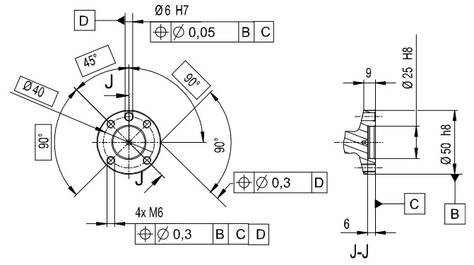
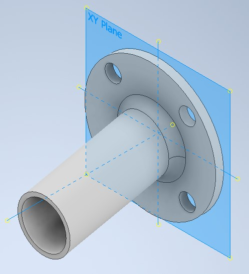
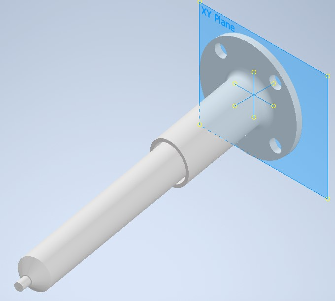
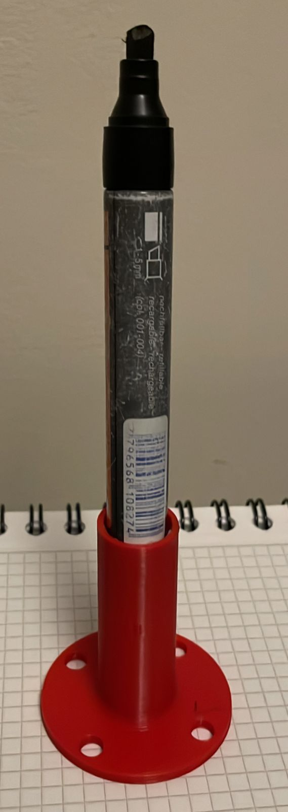
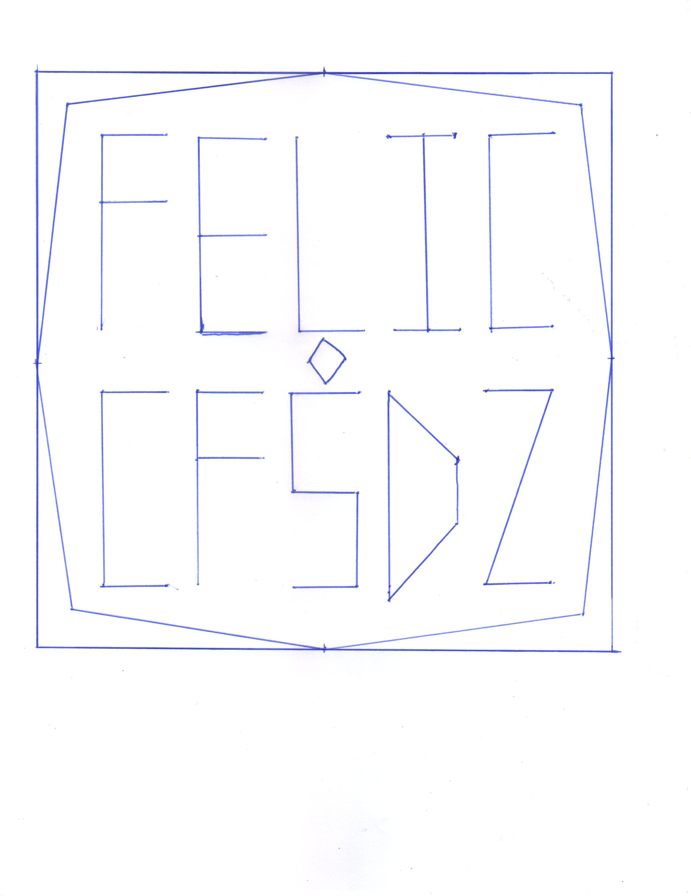
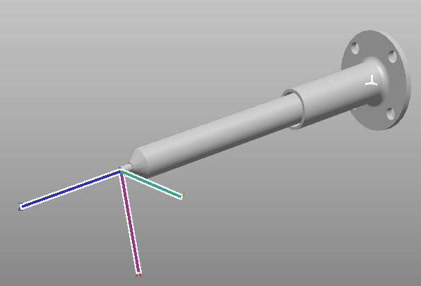
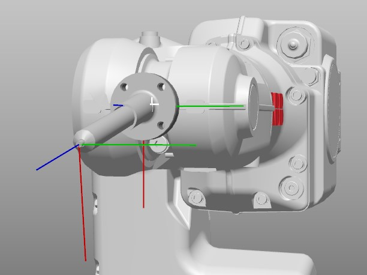

# Carlos Felipe Sánchez & Felipe Cruz
# Universidad Nacional de Colombia
# Robótica - 2023-II
# Laboratorio 1

# Contenido
En el repositorio de este laboratorio se encuentra lo siguiente:
- README.md -> Archivo base con la descripción del laboratorio.
- CAD -> Carpeta que contiene los modelos 3D de la herramienta diseñada en formatos .ipt, .iam, .stl, .step.
- RobotStudio -> Carpeta que contiene la solución de Robot Studio utilizada durante la práctica.
- Imgs -> Carpeta con imágenes utilizadas en el archivo README.
- Videos -> Carpeta con los videos resultantes del desarrollo de la práctica.

---
Tabla de Contenidos
---

- [1. Diseño de la herramienta](#1-diseño-de-la-herramienta)
- [2. Diseño de la figura a dibujar con el robot](#2-diseño-de-la-figura-a-dibujar-con-el-robot)
- [3. Incorporación de la herramienta dentro de RobotStudio](#3-incorporación-de-la-herramienta-dentro-de-robotstudio)
- [4. Diseño de la trayectoria](#4-diseño-de-la-trayectoria)
- [5. Programación en RAPID de la trayectoria](#5-programación-en-rapid-de-la-trayectoria)
- [6. Simulación del movimiento del robot en Robot Studio](#6-simulación-del-movimiento-del-robot-en-robot-studio)
- [7. Ubicación real de los elementos](#7-ubicación-real-de-los-elementos)
- [8. Implementación de la solución en los robots reales](#8-implementación-de-la-solución-en-los-robots-reales)

La solución planteada se desarrolló siguiendo los siguientes pasos. En cada uno de los siguientes pasos se describe en detalle lo realizado.
# 1. Diseño de la herramienta.
La herramienta del proceso corresponde a un marcador para escribir sobre papel. El diseño corresponde al diseño de un soporte que conecte el marcador con el flange del robot.

El diseño tuvo en consideración lo siguiente:
- El tamaño y forma del flange del robot real. El tamaño del flange y el tamaño y ubicación de los agujeros se obtiene del datasheet del robot en la página 61.

*Fig1.1: Plano del flange del robot. (Datasheet, pp 61).*

- El diámetro aproximado del marcador real a utilizar.
- La herramienta debe estar apoyada sobre el plano xy con el eje z hacia arriba (para facilitar la incorporación de esta dentro de RobotStudio).
- Colocación de un resorte para darle tolerancia al movimiento del robot.
- La punta del marcador no debe quedar alineada con el eje z ya que incrementa la probabilidad de que se presenten singularidades durante el movimiento del robot.

Teniendo en cuenta lo anterior, se realiza el diseño del soporte y el marcador en AutoDesk Inventor 2023. El resultado es el siguiente:

*Fig1.2: Soporte diseñado en Inventor. Note que la base se encuentra sobre el plano xy y la punta no se alinea con el eje z.*

*Fig1.3: Herramienta diseñada y ensamblada en Inventor.*

Posteriormente, se utiliza la impresión 3D para manufacturar el soporte del marcador en PLA. Se utiliza un resorte común y silicona para obtener la herramienta final:

*Fig1.4: Herramienta final.*

# 2. Diseño de la figura a dibujar con el robot.
Se optó por un diseño con las letras FELIC en la linea superior, CFSDZ en la línea inferior, un octágono que las rodeara, y un diamante en el centro, el rectángulo corresponde al área de trabajo definida para el work object del robot.

# 3. Incorporación de la herramienta dentro de RobotStudio.
Pasos de la incorporación:
1. El ensamble de la herramienta se exporta en formato .STEP.
2. Se importa el archivo en Robot Studio en "Importar geometría".
3. Se define un sistema de coordenadas sobre la punta de la herramienta con el eje z alineado al marcador.
4. Se crea la herramienta **Marcador** con la geometría y sistema coordenado definidos anteriormente.
5. Se asocia la herramienta con el manipulador de tal manera que la herramienta quede sobre el flange (articulación 6).

*Fig3.1: Herramienta definida en RobotStudio con su TCP.*

*Fig3.2: Herramienta ensamblada con el manipulador en RobotStudio.*

# 4. Diseño de la trayectoria
Para el diseño de la trayectoria, se establece un sistema coordenado para el WorkObject, el cual será la base para definir la trayectoria.

# 5. Programación en RAPID de la trayectoria.
# 6. Simulación del movimiento del robot en Robot Studio.
Para la simulación del movimiento sobre un plano horizontal, el WorkObject se coloca de manera que el plano xy sea paralelo al plano xy del mundo. En el siguiente video se presenta la simulación.

https://github.com/cafsanchezdi/Robotica2023-2/assets/45526932/63c66267-b9f9-43fa-b5f6-57248eb470ee

Para la simulación del movimiento sobre un plano inclinado, el WorkObject del plano horizontal se rota  45 grados respecto a su eje y. En el siguiente video se presenta la simulación.

https://github.com/cafsanchezdi/Robotica2023-2/assets/45526932/b0958817-5f97-4500-a8f2-b5b780b69daa

# 7. Ubicación real de los elementos
# 8. Implementación de la solución en los robots reales.
Para la implementación del movimiento sobre el robot real, primero se realizó la calibración de la herramienta para configurar el *tooldata* correctamente. 

Para el movimiento sobre un plano horizontal, se realizó la calibración del WorkObjecto sobre un plano horizontal real y se corrió el código del módulo. El resultado se presenta en el siguiente video:

https://github.com/cafsanchezdi/Robotica2023-2/assets/45526932/09f991a8-900e-4535-80b0-e8b4a91f5932
