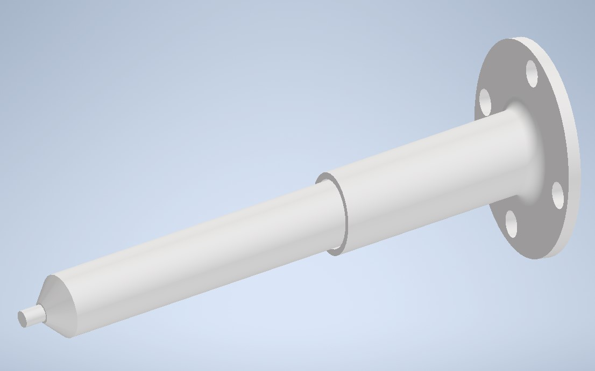
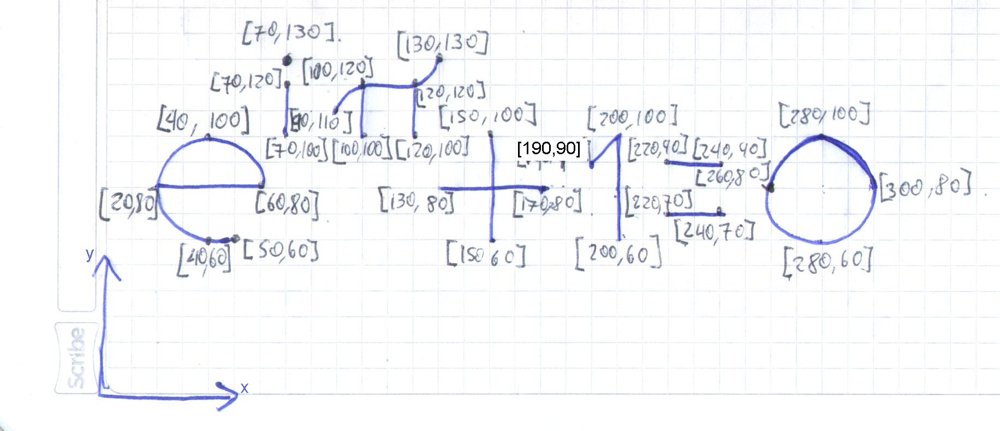
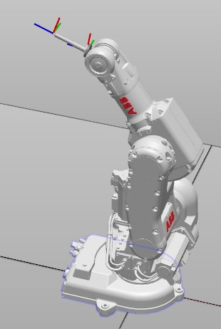

# Carlos Felipe Sánchez & Felipe Cruz
# Universidad Nacional de Colombia
# Robótica - 2023-II
# Laboratorio 2


# Contenido
En el repositorio de este laboratorio se encuentra lo siguiente:
- README.md -> Archivo base con la descripción del laboratorio.
- CAD -> Carpeta que contiene los modelos 3D de la herramienta diseñada en formatos .ipt, .iam, .stl, .sat.
- RobotStudio -> Carpeta que contiene la solución de Robot Studio utilizada durante la práctica.
- Imgs -> Carpeta con imágenes utilizadas en el archivo README.
- Videos -> Carpeta con los videos resultantes del desarrollo de la práctica.

---
Tabla de Contenidos
---

- [1. Cambios sobre el laboratorio anterior](#1-cambios-sobre-el-laboratorio-anterior)
- [2. Descripción de la solución](#2-descripción-de-la-solución)
- [3. Programa en RAPID](#3-programa-en-rapid)
- [4. Simulación del movimiento del robot en Robot Studio](#4-simulación-del-movimiento-del-robot-en-robot-studio)
- [5. Implementación de la solución en los robots reales](#5-implementación-de-la-solución-en-los-robots-reales)

# 1. Cambios sobre el laboratorio anterior
Para este laboratorio, se optó por ajustar la herramienta del primer laboratorio con el objetivo de mejorar el proceso de escritura. Primero, el agujero donde va la herramienta se redujo en tamaño hasta el punto donde el marcador encaja perfectamente y no tiene holgura. También, se retiró el resorte del interor de la herramienta.

En el laboratorio anterior, el problema con la escritura se dió por la holgura que tenía el marcador, ya que podía pasar que el brazo del robot se moviera, pero la punta del marcador no. Con la nueva herramienta esto no sucede. Además, el resorte se retiró para poder generar un modelo CAD mucho más parecido a la herramienta real (y, el resorte no es tan necesario ya que el marcador usado tiene una punta móvil).



*Fig1.1: Modelo CAD de la herramienta. Notar la falta de holgura que tiene el marcador.*

También, se cambió el dibujo a realizar por la ecuación $e^{i\pi} + 1 = 0$. Esto con el fin de poder practicar la escritura con Robots y utilizar movimientos circulares/curvos del robot (en la letra "e", en el símbolo π y en el número 0).



*Fig1.2: Dibujo a realizar, con coordenadas de los puntos relevantes.*

# 2. Descripción de la solución
La idea es lograr recibir 2 señales digitales de entrada, realizar ciertos procesos con el robot e indicar sobre dos señales digitales de salida. La solución planteada consiste en comenzar llevando el robot a HOME (todas las articulaciónes en 0 grados), para luego correr un bucle infinito (WHILTE TRUE) que revise las señales digitales de entrada y decida qué hacer en base a ellas (usando IF). Dentro de cada bloque de código IF se actualizan las señales digitales de salida para indicar lo correspondiente y se ejecuta una subrutina que realice la operación indicada.

Se realizó un código bastante modular, insertando en diferentes procesos cada una de las acciones que debe realizar el robot. A continuación se presenta el nombre dado a cada uno de los procesos junto con una breve descripción de qué hace el robot y la lógica de programación utilizada.

En el robot real, las dos señales de entrada digitales eran DI_01 y DI_02 (pulsadores verdes), y, las dos salidas digitales eran DO_02 y DO_03 (leds verdes).

- main -> Proceso principal. Al comienzo, el robot va a HOME, y luego queda en un bucle infinito revisando las entradas digitales. Si la entrada 1 se activa, enciende la salida 2, realiza la escritura de la ecuación, sube un poco en "z", apaga la salida 2, y regresa al HOME. Si la entrada 2 se activa, enciende la salida 3, va a posición de mantenimiento y se queda esperando a que se presione la entrada 1 (WaitDI), para luego apagar la salida 3 y volver a HOME.
- Subir -> El robot detecta su posición actual y sube en "z" un poco (respecto al sistema coordenado global). Esto se usa antes de retornar a HOME después de escribir.
- Homming -> El robot va a HOME. El movimiento se realiza sobre las articulaciones de manera absoluta (MoveAbsJ) de tal manera que todas quedan en 0.
- Mantener -> El robot va a posición de mantenimiento. El movimiento también se realiza sobre las articulaciones de manera absoluta (MoveAbsJ). En este caso, la posición de mantenimiento se define como [0,0,-125,0,-45,0]. 
- Escribir -> El robot realiza la escritura de cada uno de los símbolos, letras, o números especificados en la ecuación.
- Letra___, Símbolo___, Número___ -> El robot realiza el símbolo, letra, o número especificado. Cada elemento a escribir tiene su propio "home" y proceso. En el proceso, el robot se acerca a dicho "home" (cercano a la zona de escritura), realiza la escritura (usando MoveJ para las rectas y MoveC para las curvas), y luego retorna al "home" de la letra, símbolo, o número.



*Fig2.1: Posición de mantenimiento definida.*

# 3. Programa en RAPID
Los procesos del siguiente código se explican con más detalle en la sección anterior. Para activar o desactivar salidas digitales se utiliza "Set" y "Reset", respectivamente. También, se utiliza TPWrite para escribir en el TeachPendant información sobre qué proceso se está llevando a cabo.

Las variables a usar son: la herramienta "Marcador", el objeto de trabajo "Workobject_Pastel", un robtarget "Target_0" para utilizar en la función de Subir, las jointtargets del HOME y de mantenimiento, y todos los robtarget usados en la escritura de la ecuación.

```
MODULE Module1
    PERS tooldata Marcador:=[TRUE,[[22.682,0,131.636],[0.996194698,0,0.087155743,0]],[0.1,[0,0,1],[1,0,0,0],0,0,0]];
    TASK PERS wobjdata Workobject_Pastel:=[FALSE,TRUE,"",[[392.758777548,-135.855951341,82.374577535],[1,0,0,0]],[[0,0,0],[1,0,0,0]]];
    PERS robtarget Target_0:=[[672.003,-55.8557,465.275],[0.0870279,7.77767E-7,0.996206,1.3654E-5],[-1,0,-1,0],[9E+9,9E+9,9E+9,9E+9,9E+9,9E+9]];
    CONST jointtarget home:=[[0,0,0,0,0,0],[9E+09,9E+09,9E+09,9E+09,9E+09,9E+09]];
    CONST jointtarget mantenimiento:=[[0,0,-125,0,-45,0],[9E+09,9E+09,9E+09,9E+09,9E+09,9E+09]];
    
    CONST robtarget Target_E0:=[[40,80,50],[0,0,1,0],[0,0,0,0],[9E+09,9E+09,9E+09,9E+09,9E+09,9E+09]];
    CONST robtarget Target_E1:=[[20,80,0],[0,0,1,0],[0,0,0,0],[9E+09,9E+09,9E+09,9E+09,9E+09,9E+09]];
    CONST robtarget Target_E2:=[[60,80,0],[0,0,1,0],[0,0,0,0],[9E+09,9E+09,9E+09,9E+09,9E+09,9E+09]];
    CONST robtarget Target_E3:=[[40,100,0],[0,0,1,0],[0,0,0,0],[9E+09,9E+09,9E+09,9E+09,9E+09,9E+09]];
    CONST robtarget Target_E4:=[[40,60,0],[0,0,1,0],[0,0,0,0],[9E+09,9E+09,9E+09,9E+09,9E+09,9E+09]];
    CONST robtarget Target_E5:=[[50,60,0],[0,0,1,0],[0,0,0,0],[9E+09,9E+09,9E+09,9E+09,9E+09,9E+09]];
    
    CONST robtarget Target_I0:=[[70,110,50],[0,0,1,0],[0,0,0,0],[9E+09,9E+09,9E+09,9E+09,9E+09,9E+09]];
    CONST robtarget Target_I1:=[[70,100,0],[0,0,1,0],[0,0,0,0],[9E+09,9E+09,9E+09,9E+09,9E+09,9E+09]];
    CONST robtarget Target_I2:=[[70,120,0],[0,0,1,0],[0,0,0,0],[9E+09,9E+09,9E+09,9E+09,9E+09,9E+09]];
    CONST robtarget Target_I3:=[[70,130,0],[0,0,1,0],[0,0,0,0],[9E+09,9E+09,9E+09,9E+09,9E+09,9E+09]];
    
    CONST robtarget Target_PI0:=[[110,110,50],[0,0,1,0],[0,0,0,0],[9E+09,9E+09,9E+09,9E+09,9E+09,9E+09]];
    CONST robtarget Target_PI1:=[[90,110,0],[0,0,1,0],[0,0,0,0],[9E+09,9E+09,9E+09,9E+09,9E+09,9E+09]];
    CONST robtarget Target_PI2:=[[93.27,117.4,0],[0,0,1,0],[0,0,0,0],[9E+09,9E+09,9E+09,9E+09,9E+09,9E+09]];
    CONST robtarget Target_PI3:=[[100,120,0],[0,0,1,0],[0,0,0,0],[9E+09,9E+09,9E+09,9E+09,9E+09,9E+09]];
    CONST robtarget Target_PI4:=[[120,120,0],[0,0,1,0],[0,0,0,0],[9E+09,9E+09,9E+09,9E+09,9E+09,9E+09]];
    CONST robtarget Target_PI5:=[[127.34,123.21,0],[0,0,1,0],[0,0,0,0],[9E+09,9E+09,9E+09,9E+09,9E+09,9E+09]];
    CONST robtarget Target_PI6:=[[130,130,0],[0,0,1,0],[0,0,0,0],[9E+09,9E+09,9E+09,9E+09,9E+09,9E+09]];
    CONST robtarget Target_PI7:=[[100,100,0],[0,0,1,0],[0,0,0,0],[9E+09,9E+09,9E+09,9E+09,9E+09,9E+09]];
    CONST robtarget Target_PI8:=[[120,100,0],[0,0,1,0],[0,0,0,0],[9E+09,9E+09,9E+09,9E+09,9E+09,9E+09]];
    
    CONST robtarget Target_M0:=[[150,80,50],[0,0,1,0],[0,0,0,0],[9E+09,9E+09,9E+09,9E+09,9E+09,9E+09]];
    CONST robtarget Target_M1:=[[130,80,0],[0,0,1,0],[0,0,0,0],[9E+09,9E+09,9E+09,9E+09,9E+09,9E+09]];
    CONST robtarget Target_M2:=[[170,80,0],[0,0,1,0],[0,0,0,0],[9E+09,9E+09,9E+09,9E+09,9E+09,9E+09]];
    CONST robtarget Target_M3:=[[150,60,0],[0,0,1,0],[0,0,0,0],[9E+09,9E+09,9E+09,9E+09,9E+09,9E+09]];
    CONST robtarget Target_M4:=[[150,100,0],[0,0,1,0],[0,0,0,0],[9E+09,9E+09,9E+09,9E+09,9E+09,9E+09]];
    
    CONST robtarget Target_U0:=[[200,80,50],[0,0,1,0],[0,0,0,0],[9E+09,9E+09,9E+09,9E+09,9E+09,9E+09]];
    CONST robtarget Target_U1:=[[190,90,0],[0,0,1,0],[0,0,0,0],[9E+09,9E+09,9E+09,9E+09,9E+09,9E+09]];
    CONST robtarget Target_U2:=[[200,100,0],[0,0,1,0],[0,0,0,0],[9E+09,9E+09,9E+09,9E+09,9E+09,9E+09]];
    CONST robtarget Target_U3:=[[200,60,0],[0,0,1,0],[0,0,0,0],[9E+09,9E+09,9E+09,9E+09,9E+09,9E+09]];
    
    CONST robtarget Target_Q0:=[[230,80,50],[0,0,1,0],[0,0,0,0],[9E+09,9E+09,9E+09,9E+09,9E+09,9E+09]];
    CONST robtarget Target_Q1:=[[220,70,0],[0,0,1,0],[0,0,0,0],[9E+09,9E+09,9E+09,9E+09,9E+09,9E+09]];
    CONST robtarget Target_Q2:=[[240,70,0],[0,0,1,0],[0,0,0,0],[9E+09,9E+09,9E+09,9E+09,9E+09,9E+09]];
    CONST robtarget Target_Q3:=[[220,90,0],[0,0,1,0],[0,0,0,0],[9E+09,9E+09,9E+09,9E+09,9E+09,9E+09]];
    CONST robtarget Target_Q4:=[[240,90,0],[0,0,1,0],[0,0,0,0],[9E+09,9E+09,9E+09,9E+09,9E+09,9E+09]];
    
    CONST robtarget Target_C0:=[[280,80,50],[0,0,1,0],[0,0,0,0],[9E+09,9E+09,9E+09,9E+09,9E+09,9E+09]];
    CONST robtarget Target_C1:=[[260,80,0],[0,0,1,0],[0,0,0,0],[9E+09,9E+09,9E+09,9E+09,9E+09,9E+09]];
    CONST robtarget Target_C2:=[[280,100,0],[0,0,1,0],[0,0,0,0],[9E+09,9E+09,9E+09,9E+09,9E+09,9E+09]];
    CONST robtarget Target_C3:=[[300,80,0],[0,0,1,0],[0,0,0,0],[9E+09,9E+09,9E+09,9E+09,9E+09,9E+09]];
    CONST robtarget Target_C4:=[[280,60,0],[0,0,1,0],[0,0,0,0],[9E+09,9E+09,9E+09,9E+09,9E+09,9E+09]];
    PROC main()
        Reset DO_02;
        Reset DO_03;
        Homming;
        WHILE TRUE DO
            IF DI_01 = 1 THEN
                Set DO_02;
                Escribir;
                Reset DO_02;
                Subir;
                Homming;
            ELSEIF DI_02 = 1 THEN
                Set DO_03;
                Mantener;
                WaitDI DI_01,1;
                Reset DO_03;
                Homming;
            ENDIF
        ENDWHILE
    ENDPROC
    PROC Subir()
        TPWrite "Subiendo...";
        Target_0:=CRobT(\Tool:=tool0 \WObj:=wobj0);
        Target_0.trans.z:=Target_0.trans.z + 200;
        MoveJ Target_0,v50,fine,tool0\WObj:=wobj0;
    ENDPROC
    PROC Homming()
        TPWrite "Homming...";
        MoveAbsJ home, v100, fine, tool0;
    ENDPROC
    PROC Mantener()
        TPWrite "Mantenimiento...";
        MoveAbsJ mantenimiento, v100, fine, tool0;
    ENDPROC
    PROC Escribir()
        LetraE;
        LetraI;
        LetraPI;
        SimboloMas;
        NumeroUno;
        SimboloEqual;
        NumeroCero;
    ENDPROC
    PROC LetraE()
        MoveJ Target_E0,v100,fine,Marcador\WObj:=Workobject_Pastel;
        MoveJ Target_E1,v100,fine,Marcador\WObj:=Workobject_Pastel;
        MoveJ Target_E2,v100,fine,Marcador\WObj:=Workobject_Pastel;
        MoveC Target_E3,Target_E1,v100,fine,Marcador\WObj:=Workobject_Pastel;
        MoveC Target_E4,Target_E5,v100,fine,Marcador\WObj:=Workobject_Pastel;
        MoveJ Target_E0,v100,fine,Marcador\WObj:=Workobject_Pastel;
    ENDPROC
    PROC LetraI()
        MoveJ Target_I0,v100,fine,Marcador\WObj:=Workobject_Pastel;
        MoveJ Target_I1,v100,fine,Marcador\WObj:=Workobject_Pastel;
        MoveJ Target_I2,v100,fine,Marcador\WObj:=Workobject_Pastel;
        MoveJ Target_I0,v100,fine,Marcador\WObj:=Workobject_Pastel;
        MoveJ Target_I3,v100,fine,Marcador\WObj:=Workobject_Pastel;
        MoveJ Target_I0,v100,fine,Marcador\WObj:=Workobject_Pastel;
    ENDPROC
    PROC LetraPI()
        MoveJ Target_PI0,v100,fine,Marcador\WObj:=Workobject_Pastel;
        MoveJ Target_PI1,v100,fine,Marcador\WObj:=Workobject_Pastel;
        MoveC Target_PI2,Target_PI3,v100,fine,Marcador\WObj:=Workobject_Pastel;
        MoveJ Target_PI4,v100,fine,Marcador\WObj:=Workobject_Pastel;
        MoveC Target_PI5,Target_PI6,v100,fine,Marcador\WObj:=Workobject_Pastel;
        MoveJ Target_PI0,v100,fine,Marcador\WObj:=Workobject_Pastel;
        MoveJ Target_PI7,v100,fine,Marcador\WObj:=Workobject_Pastel;
        MoveJ Target_PI3,v100,fine,Marcador\WObj:=Workobject_Pastel;
        MoveJ Target_PI0,v100,fine,Marcador\WObj:=Workobject_Pastel;
        MoveJ Target_PI8,v100,fine,Marcador\WObj:=Workobject_Pastel;
        MoveJ Target_PI4,v100,fine,Marcador\WObj:=Workobject_Pastel;
        MoveJ Target_PI0,v100,fine,Marcador\WObj:=Workobject_Pastel;
    ENDPROC
    PROC SimboloMas()
        MoveJ Target_M0,v100,fine,Marcador\WObj:=Workobject_Pastel;
        MoveJ Target_M1,v100,fine,Marcador\WObj:=Workobject_Pastel;
        MoveJ Target_M2,v100,fine,Marcador\WObj:=Workobject_Pastel;
        MoveJ Target_M0,v100,fine,Marcador\WObj:=Workobject_Pastel;
        MoveJ Target_M3,v100,fine,Marcador\WObj:=Workobject_Pastel;
        MoveJ Target_M4,v100,fine,Marcador\WObj:=Workobject_Pastel;
        MoveJ Target_M0,v100,fine,Marcador\WObj:=Workobject_Pastel;
    ENDPROC
    PROC NumeroUno()
        MoveJ Target_U0,v100,fine,Marcador\WObj:=Workobject_Pastel;
        MoveJ Target_U1,v100,fine,Marcador\WObj:=Workobject_Pastel;
        MoveJ Target_U2,v100,fine,Marcador\WObj:=Workobject_Pastel;
        MoveJ Target_U3,v100,fine,Marcador\WObj:=Workobject_Pastel;
        MoveJ Target_U0,v100,fine,Marcador\WObj:=Workobject_Pastel;
    ENDPROC
    PROC SimboloEqual()
        MoveJ Target_Q0,v100,fine,Marcador\WObj:=Workobject_Pastel;
        MoveJ Target_Q1,v100,fine,Marcador\WObj:=Workobject_Pastel;
        MoveJ Target_Q2,v100,fine,Marcador\WObj:=Workobject_Pastel;
        MoveJ Target_Q0,v100,fine,Marcador\WObj:=Workobject_Pastel;
        MoveJ Target_Q3,v100,fine,Marcador\WObj:=Workobject_Pastel;
        MoveJ Target_Q4,v100,fine,Marcador\WObj:=Workobject_Pastel;
        MoveJ Target_Q0,v100,fine,Marcador\WObj:=Workobject_Pastel;
    ENDPROC
    PROC NumeroCero()
        MoveJ Target_C0,v100,fine,Marcador\WObj:=Workobject_Pastel;
        MoveJ Target_C1,v100,fine,Marcador\WObj:=Workobject_Pastel;
        MoveC Target_C2,Target_C3,v100,fine,Marcador\WObj:=Workobject_Pastel;
        MoveC Target_C4,Target_C1,v100,fine,Marcador\WObj:=Workobject_Pastel;
        MoveJ Target_C0,v100,fine,Marcador\WObj:=Workobject_Pastel;
    ENDPROC
ENDMODULE
```

# 4. Simulación del movimiento del robot en Robot Studio
El siguiente video presenta la simulación en RobotStudio de la implementación del código anterior. Note que en la simulación, se activaba y desactivaba la entrada digital para simular lo que sucede en vida real cuando se presiona un pulsador y se suelta.

En la simulación, el robot empieza totalmente desconfigurado en una posición arbitraria. Al darle comenzar, el robot se dirige a HOME. Se muestra cómo se va a posición de mantenimiento, se regresa a HOME, se realiza la escritura de la ecuación, se regresa a HOME y se termina yendo a posición de mantenimiento nuevamente.

https://github.com/cafsanchezdi/Robotica2023-2/assets/45526932/8e7bae58-5ea7-4f2f-baa7-a0c621e52092


# 5. Implementación de la solución en los robots reales
En el siguiente video, se presenta la implementación de la práctica sobre el robot real IRB140. Una anotación a realizar es que el primer LED está invertido (es decir, se enciende con la salida en 0 y se apaga con la salida en 1), por lo tanto en el video el comportamiento de dicho LED se ve al revés (encendido en HOME y, apagado en mantenimiento y en escritura). Esto se podría arreglar desde el código RAPID cambiando los Set y Reset pero para no demorar a otros compañeros se decidió dejar así. Además, el robot no terminó de escribir debido a que la zona de trabajo quedó fuera de su rango, lo cual se podría arreglar acercándole el tablero al robot, pero nuevamente se decidió dejar así para no demorar a otros compañeros.

https://github.com/cafsanchezdi/Robotica2023-2/assets/45526932/e2c1f81f-0ee3-4040-9f12-b2a3ed2a8606


*Fig5.1: Resultado de escritura obtenido.*


