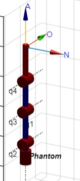

# Carlos Felipe Sánchez & Felipe Cruz
# Universidad Nacional de Colombia
# Robótica - 2023-II
# Laboratorio 4


# Contenido
En el repositorio de este laboratorio se encuentra lo siguiente:
- README.md -> Archivo base con la descripción del laboratorio.
- Catkin -> Carpeta del catkin workspace. Contiene todo el proyecto de ROS para Python.
- Matlab -> Carpeta que contiene un Matlab LiveScript para la simulación del robot con Peter Corke.
- Imgs -> Carpeta con imágenes utilizadas en el archivo README.
- Videos -> Carpeta con los videos resultantes del desarrollo de la práctica.

---
Tabla de Contenidos
---

- [1. Introducción](#1-introducción)
- [2. Código Matlab (Peter Corke)](#2-código-matlab-peter-corke)
- [3. Código Python (ROS)](#3-código-python-ros)
- [4. Configuración ROS](#4-configuración-ros)
- [5. HMI](#5-hmi)
- [6. Resultado Final](#6-resultado-final)
- [7. Robot vs Simulación](#7-robot-vs-simulación)
- [8. Conclusiones](#8-conclusiones)

# 1. Introducción
En el presente laboratorio se prueban las capacidades de modelar apropiadamente el robot Phantom X Pincher y enlazarlo con la herramienta de entorno de robótica ROS.

* Phantom X - Pincher

El Pincher es un manipuldor robótico compuesto de 5 Servomotores conectados linealmente, con comunicación serial modular, para operarlo se requiere un Hub de potencia y comunicación con el controlador, el cual recibe instrucciones y transmite datos al PC mediante un puerto USB, el Robot tiene su propia interfaz de control que nos da acceso directo a la retroalimentación del robot, sin embargo para utilizarlo con ROS implementaremos la librería de ROS "Dynamixel Workbench", que nos provee de las funciones necesarias para hacer la comunicación con el manipulador.

En términos de robótica, el Pincher tiene 4 Articulaciones, todas rotacionales, que le permiten alcanzar cualquier posición que se encuentre a su alcance, el quinto servomotor se utiliza para accionar el efector final, que en este caso es la pinza sencilla la cual le da su nombre al manipulador. Como es común con este tipo de manipuladores, la primera articulación es de base, gira alrededor del Eje Z del origen para permitir el posicionamiento del efector en un punto del plano XY de manera efectiva, mientras las demás articulaciones corresponden a hombro, codo, y muñeca, dedicadas al posicionamiento preciso del efector final.


# 2. Código Matlab (Peter Corke)


*Fig2.1: Diagrama del Robot Phantom para obtener los parámetros DH y la simulación.*

Se realiza la medición de los eslabones del robot Phantom real y se obtienen los siguientes valores:
```
L1 = 0.0455; %m
L2 = 0.103; %m
L3 = 0.103; %m
L4 = 0.11; %m (TCP)
Lm = 0.0315; %m  
```

Se programa en Matlab la matriz DH del robot, con la cual se pueden definir los Links del objeto SerialLink de la librería Peter Corke:
```
DH = [q1	L1	0	            -pi/2	0	0;
      q2	0	sqrt(L2^2+Lm^2)	0	    0	-pi/2;
      q3	0	L3	            0	    0	0;
      q4	0	L4	            0	    0	0];

for i=1:size(DH)
    L(i) = Link(DH(i,:));
end

Phantom = SerialLink(L,'name','Phantom','tool',trotx(-pi/2)*troty(pi/2))
```

Se establecen los valores deseados para las articulaciones, los cuales son 5 puntos (incluyendo el Home -> punto 1):
```
target1 = deg2rad([0 0 0 0]);
target2 = deg2rad([25 25 20 -20]);
target3 = deg2rad([-35 35 -30 30]);
target4 = deg2rad([85 -20 55 25]);
target5 = deg2rad([80 -35 55 -45]);
```

Finalmente, con el siguiente código, se puede visualizar la pose del robot que se obtiene al fijar las articulaciones en los valores deseados:
```
figure();
Phantom = SerialLink(L,'name','Phantom','tool',trotx(-pi/2)*troty(pi/2));
view(...);
Phantom.plot(target_,'noa','jaxes','notiles','floorlevel',0,'noshadow','delay',1);
axis tight;
```

En el código anterior, el valor dentro de *view* cambia para cada pose (con el fin de visualizar mejor la posición), y dentro del *Phantom.plot* se debe colocar el target deseado.

Los resultados gráficos de cada una de las poses se encuentran en [7. Robot vs Simulación](#7-robot-vs-simulación).

# 3. Código Python (ROS)

El proyecto se hizo en base al repositorio: https://github.com/fegonzalez7/dynamixel_one_motor.

Lo primero fue crear un nuevo script *HMI.py*, y dentro del *CMakeLists.txt* se agregó el script:
```
catkin_install_python(PROGRAMS
  scripts/jointSrv.py
  scripts/jointSub.py
  scripts/jointPub.py
  scripts/HMI.py
  DESTINATION ${CATKIN_PACKAGE_BIN_DESTINATION}
)
```

Luego, se colocaron las articulaciones del robot en *config/basic.yaml*, para que al conectarse a ROS intente buscar dichas articulaciones:
```
joint_1:
  ID: 1
  Return_Delay_Time: 0
joint_2:
  ID: 2
  Return_Delay_Time: 0
joint_3:
  ID: 3
  Return_Delay_Time: 0
joint_4:
  ID: 4
  Return_Delay_Time: 0
```

**HMI.PY**

El script base del proyecto. A continuación se presenta el script, el cual está comentado con información sobre qué hace cada función.
```
import rospy
import time
from std_msgs.msg import String
from dynamixel_workbench_msgs.srv import DynamixelCommand
import tkinter as tk
from PIL import Image, ImageTk
from sensor_msgs.msg import JointState

# Definir los puntos objetivo
points = [
    [0,0,0,0],
    [25,25,20,-20],
    [-35,35,-30,30],
    [85,-20,55,25],
    [80,-35,55,-45]
]

# Crear la ventana de la interfaz gráfica
root = tk.Tk()
root.title("Control Phantom")

# Crear una variable de seguimiento para la selección de puntos
selected_point = tk.StringVar()

# Crear una función para mover los motores al punto seleccionado
def move_to_selected_point():
    point_index = int(selected_point.get())
    if 0 <= point_index < len(points):
        p = points[point_index]
        moveJoint(1, castDegreesToGoal(p[0]))
        moveJoint(2, castDegreesToGoal(p[1]))
        moveJoint(3, castDegreesToGoal(p[2]))
        moveJoint(4, castDegreesToGoal(p[3]))

# Colocar nombres y titulo
tk.Label(root, text="HMI para controlar robot Phantom").pack()
tk.Label(root, text="Felipe Cruz").pack()
tk.Label(root, text="Carlos Sanchez").pack()

# Colocar logo de la U
image_path = '/home/feli/Documents/Robotica/Lab4/Catkin/src/scripts/UNAL.jpeg'
img = Image.open(image_path)
img = ImageTk.PhotoImage(img)
image_label = tk.Label(root, image=img)
image_label.pack()

# Crear etiqueta y menú desplegable para seleccionar un punto
point_label = tk.Label(root, text="Seleccionar un punto:")
point_label.pack()
point_dropdown = tk.OptionMenu(root, selected_point, *range(len(points)))
point_dropdown.pack()

# Crear un botón para mover a ese punto
move_button = tk.Button(root, text="Mover al punto", command=move_to_selected_point)
move_button.pack()

# Función para cerrar la ventana de la interfaz gráfica
def close_window():
    root.destroy()

# Crear un botón para cerrar la ventana
exit_button = tk.Button(root, text="Cerrar", command=close_window)
exit_button.pack()

# Crear espacio para mostrar la posicion de los motores
position_label = tk.Label(root, text="SIN DATOS...")
position_label.pack()

# Funcion para usar el servicio para mover los motores
def jointCommand(command, id_num, addr_name, value, time):
    #rospy.init_node('joint_node', anonymous=False)
    rospy.wait_for_service('dynamixel_workbench/dynamixel_command')
    try:        
        dynamixel_command = rospy.ServiceProxy('/dynamixel_workbench/dynamixel_command', DynamixelCommand)
        result = dynamixel_command(command,id_num,addr_name,value)
        rospy.sleep(time)
        return result.comm_result
    except rospy.ServiceException as exc:
        print(str(exc))

# Funcion que mueve un motor a una posicion especifica
def moveJoint(id, val):
    # id -> (1,4)
    # val -> (0,1023)
    if(not (id in [1,2,3,4])):
        raise RuntimeError("Wrong id!")
    jointCommand('', id, 'Torque_Limit', 400, 0)
    jointCommand('', id, 'Goal_Position', max(min(1023,val),0), 0.5)
    time.sleep(0.5)

# Convertir los grados al valor que recibe el motor
def castDegreesToGoal(deg):
    # deg -> (-150, 150)
    return round(3.41*deg + 511.5)

# Definir la función callback para actualizar los valores en tiempo real
def callback(data):
    position_label.config(text=f"{data.position}")

def listener():
    rospy.init_node('joint_listener', anonymous=True)
    rospy.Subscriber("/dynamixel_workbench/joint_states", JointState, callback)

def update_gui():
    listener() # Leer datos
    root.after(1000, update_gui)  # Actualizar cada segundo

# Funcion principal. Manda al home y abre el HMI.
if __name__ == '__main__':
    try:   
        moveJoint(1,castDegreesToGoal(0))    
        moveJoint(2,castDegreesToGoal(0))    
        moveJoint(3,castDegreesToGoal(0))    
        moveJoint(4,castDegreesToGoal(0))   
        time.sleep(2)   
    except rospy.ROSInterruptException:
        pass

    # Iniciar un hilo para la actualización de la GUI
    update_gui()

    root.mainloop()
```

Al iniciar, el código manda al robot a ir al Home (todas las articulaciones en 0). Luego, inicializa un hilo *update_gui* que se encarga de leer las posiciones de las articulaciones cada segundo. Y, finalmente ejecuta la interfaz gráfica (HMI), que se realizó con la librería *tkinter*.

Dentro de la interfaz gráfica se define un selector para definir cuál de los 5 puntos se desea (en este caso, diferente a Matlab, los puntos arrancan en 0 y no en 1). También, se define un botón encargado de mandar la instrucción al robot de moverse al punto seleccionado, utilizando la función *move_to_selected_point*.

**Funciones ROS**

- La función *listener* lee las posiciones de las articulaciones usando el tópico *joint_states* del Dynamixel Workbench.

- La función *moveJoint* recibe el id del motor y el valor deseado (goal), y manda el mensaje con la función *jointCommand* que se encarga de utilizar el servicio *dynamixel_command* del Dynamixel Workbench. La función también fija el límite de torque a 400 (valor establecido en el repositorio original). El movimiento de los motores se realiza uno a uno (dos motores no se mueven nunca en simultáneo), tal como lo pide la guía.

- La función *castDegreesToGoal* se utiliza en conjunto con *moveJoint*, con el fin de poder escribir la posición deseada en grados, y que se traduzca a bits tal como lo exigen los motores. Para definir esta conversión se tuvo en cuenta la figura:


*Fig3.1: Información angular de los motores AX12 del Robot Phantom.*

La conversión del ángulo se hizo de tal manera que los valores angulares fueran de -150 grados a 150 grados, con 0 grados siendo el punto de 512 bits (es decir, el Home definido es con todos los motores en 512 bits).

# 4. Configuración ROS
Este tutorial se realiza sobre una máquina virtual Ubuntu v20, que corre sobre un computador Windows 10 en VMWarePlayer.

Al conectar el robot real al computador, se obtiene la siguiente ventana emergente:


*Fig4.1: Ventana emergente que sale al conectar el robot.*
Se debe seleccionar *Connect to a virtual machine*, y verificar que la máquina virtual sea la que tiene el proyecto ROS.

Para configurar y ejecutar el proyecto se debe realizar lo siguiente, **CON EL ROBOT REAL CONECTADO AL COMPUTADOR**:

1. Navegar en la terminal hasta la base del proyecto (en este caso, estar en *.../Catkin*).

2. Correr el siguiente comando para compilar el proyecto:
```
catkin_make
source devel/setup.bash
```

3. Correr el siguiente comando para ver dónde está conectado el robot real:
```
ls /dev/tty*
```
Debería aparecer un valor del tipo */dev/ttyUSB*. En este caso, es *ttyUSB0*, en caso de ser otro número, se debe editar el código del proyecto para tener el número correcto (se puede usar la función *replaceAll* de *VSCode*).

En caso de que no aparezca ningún *ttyUSB* el robot no está siendo detectado. En este caso, desconectar y conectar nuevamente. 
Otro comando de interés es *lsusb*.

4. Correr el siguiente comando para otorgar los permisos para el uso del puerto USB (no olvidar poner el número del puerto correcto):
```
sudo chmod 777 /dev/ttyUSB0
```

5. Correr el siguiente comando para lanzar el proyecto:
```
roslaunch dynamixel_one_motor one_controller.launch
```
Este comando automáticamente crea el *roscore* (no es necesario correrlo en otra terminal), y realiza la conexión al robot Phantom.

Se debe observar como en la terminal aparece la detección de los 4 motores.

6. Finalmente, en otra terminal, correr el siguiente comando para ejecutar el script Python de la interfaz HMI:
```
rosrun dynamixel_one_motor HMI.py
```

El siguiente video resume todo el proceso anterior:

https://github.com/cafsanchezdi/Robotica2023-2/assets/45526932/6e90e828-7ed8-499e-94ea-0c7733e86b5b

# 5. HMI
El siguiente video muestra el funcionamiento y uso de la interfaz HMI. Se puede observar la actualización en tiempo real de las posiciones de los motores (línea de texto inferior dentro la interfaz), siempre y cuando no se esté moviendo a un punto (mientras se mueve a un punto, se detiene la lectura de datos debido al tipo de comunicación con el sistema).

https://github.com/cafsanchezdi/Robotica2023-2/assets/45526932/3ff9a900-c426-4442-adac-80e12b64cf1b

# 6. Resultado Final
El siguiente video muestra el uso de la interfaz HMI junto con el movimiento del robot real. En el video se observa cómo al inicializar la ejecución el robot se mueve al Home. Luego, se mueve el robot a cada una de las posiciones posibles usando la interfaz HMI.

https://github.com/cafsanchezdi/Robotica2023-2/assets/45526932/0d6cd432-2f40-4cab-a8fe-6137007e1369

# 7. Robot vs Simulación
En esta sección se ilustran las imágenes obtenidas en la simulación de Matlab (Peter Corke) junto con las imágenes del robot real en dichas posiciones.

- **Target 1 (Home)**
  
 

- **Target 2**
  
 

- **Target 3**
  
 

- **Target 4**
  
 

- **Target 5**
  
 

# 8. Conclusiones

* Parámetros DH: Utilizando las dimensiones medidas, se obtuvieron los parámetros DH del robot Phantom X Pincher. Estos parámetros son esenciales para la modelización cinemática y control del robot.
* Integración con ROS: Se desarrolló un script que utiliza ROS para controlar el movimiento de cada una de las articulaciones del robot Phantom X Pincher. El script realiza movimientos secuenciales entre posiciones angulares características, lo que permite controlar el robot de manera efectiva.
* Validación de Poses: Se probaron varias poses del robot generadas a partir de valores articulares, asegurando que no interfirieran con los límites articulares ni con objetos en el espacio de trabajo.
* Interfaz de Usuario (HMI): Se creó una interfaz de usuario que muestra información relevante, como los datos del grupo, una imagen perspectiva de la posición actual del manipulador, opciones para seleccionar poses predefinidas, valores articulares reales de cada motor y una representación gráfica de la posición actual del manipulador.
* Comparación entre Simulación y Robot Real: Se verificó que las configuraciones obtenidas en la simulación coincidan con las configuraciones reales del robot Phantom X Pincher, lo que demuestra la validez de la simulación y el control.


