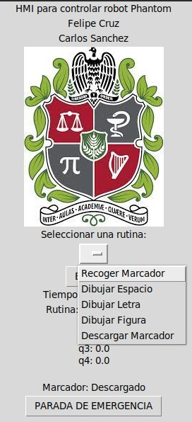

# Carlos Felipe Sánchez & Felipe Cruz
# Universidad Nacional de Colombia
# Robótica - 2023-II
# Laboratorio 5


# Contenido
En el repositorio de este laboratorio se encuentra lo siguiente:
- README.md -> Archivo base con la descripción del laboratorio.
- Catkin -> Carpeta del catkin workspace. Contiene todo el proyecto de ROS para Python.
- Imgs -> Carpeta con imágenes utilizadas en el archivo README.
- Videos -> Carpeta con los videos resultantes del desarrollo de la práctica.

---
Tabla de Contenidos
---

- [1. Introducción](#1-introducción)
- [2. Descripción de la Solución](#2-descripción-de-la-solución)
- [3. Base Portaherramientas y Marcador](#3-base-portaherramientas-y-marcador)
- [4. Cinemática Inversa](#4-cinemática-inversa)
- [5. Código](#5-código)
- [6. HMI](#6-hmi)
- [7. Resultados y Videos](#7-resultados-y-videos)
- [8. Conclusiones](#8-conclusiones)

# 1. Introducción

El proyecto se centró en el desarrollo de una interfaz humano-máquina (HMI) para el control de un robot Phantom x100, también conocido como Pincher, de 4 grados de libertad. El objetivo principal consistía en habilitar la ejecución de cinco rutinas específicas: recoger marcador, dibujar el espacio de trabajo, representar letras, crear figuras y descargar el marcador.

Los robots Phantom, reconocidos por su versatilidad y aplicación en entornos educativos, son manipuladores de bajo costo y alta versatilidad. Estos robots, habitualmente compuestos por servomotores Dynamixel, ofrecen una estructura modular y son fácilmente programables. Son ampliamente utilizados en entornos educativos y de investigación para enseñar conceptos de robótica, cinemática y control de robots.

El proceso de creación de esta solución involucró múltiples etapas, desde el diseño de un soporte para el marcador mediante impresión 3D, la obtención de las fórmulas de cinemática inversa para el robot, hasta la implementación de ROS y Dynamixel Workbench en Python para el control del robot y la programación de las rutinas asociadas. Finalmente, se logró una integración exitosa entre la ejecución de las rutinas y la HMI desarrollada.

Los resultados obtenidos reflejaron un funcionamiento adecuado de todas las etapas del proyecto, a pesar del desafío inherente en el proceso de desarrollo de las rutinas, el cual se basó en ajustes iterativos debido a la incertidumbre generada por las mediciones reales del robot.

El presente informe documenta detalladamente cada fase del desarrollo, destacando los aspectos clave y los logros alcanzados en la implementación de la solución propuesta.


*Fig1.1: Robot Phantom.*

# 2. Descripción de la Solución

## Etapa 1: Diseño del Soporte para el Marcador en Impresión 3D
Se creó un soporte específico para el marcador utilizando tecnología de impresión 3D. Los detalles del diseño se encuentran en la [sección 3](#3-base-portaherramientas-y-marcador).

## Etapa 2: Obtención de Fórmulas para Cinemática Inversa
Se procedió a obtener las fórmulas necesarias para la cinemática inversa del robot Phantom x100. Estas fórmulas se basaron en mediciones de dimensiones del robot real, como se describe en la [sección 4](#4-cinemática-inversa).

## Etapa 3: Implementación de ROS y Dynamixel Workbench en Python
Se utilizó ROS junto con el entorno de trabajo de Dynamixel, todo implementado en Python, para la conexión y control del robot. Esta etapa permitió la interacción fluida con el robot.

## Etapa 4: Programación de Rutinas Utilizando Cinemática Inversa
Las rutinas requeridas se programaron en Python, involucrando el uso de la cinemática inversa para puntos específicos del robot. Los detalles de esta implementación se encuentran en la [sección 5](#5-código).

## Etapa 5: Integración de Rutinas con la HMI Desarrollada
Se logró la integración entre la ejecución de las rutinas y la interfaz humano-máquina (HMI) desarrollada. Esta conexión, también implementada en Python, permitió la interacción intuitiva del usuario con el robot. Se detalla en la [sección 6](#6-hmi). Los resultados finales se pueden encontrar en la [sección 7](#7-resultados-y-videos).

## Nota Importante
El proceso de desarrollo de las rutinas se basó en un enfoque de prueba y error debido a la incertidumbre inherente en el modelo de cinemática inversa, originada por las mediciones reales del robot. Esto permitió ajustes iterativos para mejorar la precisión y funcionalidad de las rutinas.

# 3. Base Portaherramientas y Marcador

Para facilitar la ejecución precisa de las rutinas, se diseñó y fabricó un soporte especial para el marcador del robot Phantom x100. El proceso de creación de este soporte se dividió en dos etapas fundamentales: modelado en CAD e impresión 3D.

## Diseño en CAD y Características del Soporte
El diseño se realizó meticulosamente utilizando herramientas de modelado en CAD, con un enfoque en la funcionalidad y la no interferencia con el tablero de trabajo. Se priorizó la necesidad de asegurar el soporte al tablero de manera estable y segura, evitando dañar el tablero y permitiendo una colocación y extracción sencilla del marcador.

## Impresión 3D y Resultado Final
Tras completar el diseño, se procedió a la fabricación del soporte mediante impresión 3D. El resultado fue un soporte ergonómico y funcional que se ajusta adecuadamente al robot Phantom x100. Las siguientes imágenes muestran el resultado final:


*Fig3.1: Soporte para el marcador.*

La pieza pequeña es para ajustar el soporte al tablero con tornillos M6, de tal manera que los tornillos no tengan contacto con el tablero y así evitar daños.


*Fig3.2: Soporte para el marcador colocado sobre el tablero. Se ajusta con tornillos M6.*


*Fig3.3: Soporte con el marcador.*

El marcador se coloca sin tapa sobre el soporte mirando hacia abajo. El agujero donde se encuentra el marcador tiene esa pequeña curvatura para facilitar la inserción del marcador.

El diseño y fabricación de este soporte jugaron un papel fundamental en el correcto funcionamiento de las rutinas programadas, permitiendo una manipulación precisa y segura del marcador durante la ejecución de las tareas específicas del proyecto.

## Nota:
El crédito por el diseño del soporte del marcador se lo debemos a: https://github.com/anhernadezdu/Laboratorio5_Cinematica-Inversa_PhantomX_ROS.

Nosotros realizamos la impresión 3D de ambos portaherramientas. En este caso, debido a la baja resolución que se requiere y el hecho de que el portaherramientas no requiere soportar cargas pesadas, se realizó una impresión a alta velocidad (60 mm/s) y con bajo relleno (10%) para optimizar tiempos y material.

# 4. Cinemática Inversa
El desarrollo de la cinemática inversa se hizo en base al desarrollo que se realiza en el siguiente proyecto:
https://github.com/cychitivav/px100_ikine.

En el proyecto mencionado se utiliza un Pincher diferente al nuestro, por lo cual debemos ajustar las ecuaciones para nuestro caso. A continuación presentamos la deducción de la cinemática inversa para el robot en codo arriba (buscando evitar posibles choques con el tablero). La deducción se basa en el método geométrico con desacople de muñeca.


*Fig4.1: Diagrama para deducir la cinemática inversa. Autor: https://github.com/cychitivav/px100_ikine.*

Para la deducción de la cinemática inversa, suponemos que queremos llegar a la posición $\pmatrix{x_0\cr y_0\cr z_0}$ con orientación paralela al plano de la base del robot (tablero), ya que la sujeción del marcador se realiza del tal forma que queda perpendicular al eje del efector final. El TCP lo colocamos en la base del gripper con el approach en dirección del brazo del robot (perpendicular al gripper).

Primero, es claro que el robot solamente puede llegar a una posición xy específica moviendo la articulación 1, de tal manera que se tiene:

$$
\begin{gather*}
    q_1=atan2(y_0,x_0)
\end{gather*}
$$

## Desacople de muñeca

Se obtiene el punto $w$ sobre la articulación 4 (muñeca). Esto se logra tomando el punto objetivo y restándole la longitud requerida en dirección de approach. Para nuestro caso, el vector approach es $\pmatrix{\frac{x_0}{\sqrt{x_0^2+y_0^2}}\cr \frac{y_0}{\pmatrix{x_0^2+y_0^2}}\cr 0}$, ya que el vector de approach para el TCP que definimos es paralelo al plano xy y queremos que apunte en dirección del objetivo.

$$
\begin{align*}
    w&=
    \begin{bmatrix}
        x_0\\
        y_0\\
        z_0
    \end{bmatrix}
    -L_4
    \begin{bmatrix}
        \frac{x_0}{\sqrt{x_0^2+y_0^2}}\\
        \frac{y_0}{\sqrt{x_0^2+y_0^2}}\\
        0
    \end{bmatrix}
\end{align*}
$$

## Mecanismo 2R

Para las articulaciones intermedias (2 y 3), se tiene un mecanismo 2R que define si se tiene codo arriba o codo abajo. Se busca que el robot alcance la posición $w$ (que está sobre el plano definido por $q_1$) con las dos articulaciones intermedias. Para esto, como queremos codo arriba, se tiene el siguiente diagrama


*Fig4.2: Mecanismo 2R codo arriba para las articulaciones intermedias. Autor: https://github.com/cychitivav/px100_ikine.*

Para el mecanismo de nosotros, el Phantom no presenta la existencia del $\beta$ y $\psi$, por lo que $L_r=L_2$. Se definen, entonces, las siguientes variables:

$$
\begin{gather*}
    r = \sqrt{x_w^2+y_w^2}\\
    h = z_w-L_1\\
    c = \sqrt{r^2+h^2}\\
    \phi = \arccos{\frac{c^2-L_3^2-L_2^2}{-2L_2L_3}}\\
    \gamma = \arctan2{(h,r)}\\
    \alpha =  \arccos{\frac{L_3^2-L_2^2-c^2}{-2L_2c}}
\end{gather*}
$$

Finalmente, se obtiene que los ángulos de las articulaciones son:

$q_2$ = $\frac{\pi}{2}-\alpha-\gamma$

$q_3$ = $\frac{\pi}{2}-\phi$   

## Unión de la muñeca

Ahora, para finalizar, el robot ya está sobre el plano requerido con $q_1$ y llega hasta la muñeca $w$ utilizando $q_2$ y $q_3$. Falta obtener la orientación requerida utilizando la articulación $q_4$. Para esto, considere el siguiente diagrama:


*Fig4.3: Orientación sobre la muñeca. Autor: https://github.com/cychitivav/px100_ikine.*

En el diagrama, $\theta_a$ es el ángulo entre el eje z del mundo y el vector de approach. Como queremos que este vector sea paralelo al plano xy, tenemos que $\theta_a=\frac{\pi}{2}$. Por lo tanto, se tiene:

$$
\begin{gather*}
    q_4=\frac{\pi}{2}-q_2-q_3
\end{gather*}
$$

En resumen, se tiene que las ecuaciones de la cinemática inversa del robot son:

<div align="center">

|     Articulación      |              Ecuación               |
| :-------------------: | :---------------------------------: |
| $\mathbf{q_1}$        |           $atan2(y_0,x_0)$          |
| $\mathbf{q_2}$        |     $\frac{\pi}{2}-\alpha-\gamma$   |
| $\mathbf{q_3}$        |              $\pi-\phi$             |
| $\mathbf{q_4}$        |        $\frac{\pi}{2}-q_2-q_3$      |

</div>

Además, las mediciones realizadas sobre el robot real, tienen los siguientes valores:

$L_1$ = 44.5 mm

$L_2$ = 106 mm

$L_3$ = 105 mm

$L_4$ = 75 mm

# 5. Código

A continuación se presentan las diferentes funciones definidas referentes al control y ejecución de las rutinas del robot.

## getJointAngles
```
def getJointAngles(x,y,z):
    q1 = math.atan2(x,y)
    w = np.array([x,y,z]) - L4 * np.array([x/np.sqrt(x**2+y**2),y/np.sqrt(x**2+y**2),0])
    r = np.sqrt(w[0]**2+w[1]**2)
    h = z - L1
    c = np.sqrt(r**2+h**2)
    phi = math.acos((c**2-L3**2-L2**2)/(-2*L2*L3))
    gamma = math.atan2(h,r)
    alpha = math.acos((L3**2-L2**2-c**2)/(-2*L2*c))
    q2 = np.pi / 2 - alpha - gamma
    q3 = np.pi / 2 - phi
    q4 = np.pi / 2 - q2 - q3
    toDeg = 180.0 / np.pi
    return q1*toDeg, q2*toDeg, q3*toDeg, q4*toDeg
```

Esta función recibe la posición $x,y,z$ deseada y devuelve los ángulos de las 4 articulaciones en grados, utilizando las fórmulas de la cinemática inversa.

## jointCommand
```
def jointCommand(command, id_num, addr_name, value, time):
    rospy.wait_for_service('dynamixel_workbench/dynamixel_command')
    try:        
        dynamixel_command = rospy.ServiceProxy('/dynamixel_workbench/dynamixel_command', DynamixelCommand)
        result = dynamixel_command(command,id_num,addr_name,value)
        rospy.sleep(time)
        return result.comm_result
    except rospy.ServiceException as exc:
        print(str(exc))
```
Esta fucnión utiliza el servicio del Dynamixel Workbench para enviar comandos a las articulaciones. Recibe el comando (que siempre es ''), el *id* del servo, el nombre del atributo del servo a definir, el valor del atributo a definir y un tiempo de espera.

## moveJoint
```
def moveJoint(id, val, maxSpeed):
    if(not (id in [1,2,3,4])):
        raise RuntimeError("Wrong id!")
    jointCommand('', id, 'Torque_Limit', TorqueMax, 0)
    jointCommand('', id, 'Moving_Speed', maxSpeed, 0)
    jointCommand('', id, 'Goal_Position', max(min(1023,val),0), 0)
```
Esta función recibe el *id* del servo a mover (valor de 1 a 4), el valor en bits de la posición objetivo y la velocidad máxima en bits a la que se debe mover el servo. Se utiliza la función *jointCommand* para enviarle al servo los comandos de torque límite, velocidad límite y posición objetivo, lo cual mueve al servo hasta la posición objetivo con un torque y velocidad máximos definidos.

## moveRobot
```
def moveRobot(q1,q2,q3,q4,maxSpeed):
    moveJoint(1, castDegreesToGoal(q1), maxSpeed)
    moveJoint(2, castDegreesToGoal(q2), maxSpeed)
    moveJoint(3, castDegreesToGoal(q3), maxSpeed)
    moveJoint(4, castDegreesToGoal(q4), maxSpeed)
```

Esta función recibe los 4 ángulos de las articulaciones (en grados), y la velocidad máxima para el movimiento de los servos en bits (valor entre 0 y 1023). Esta función manda la señal de movimiento a los 4 en orden, aún cuando no se haya acabado de mover el servo anterior.

## moveRobotInversa
```
def moveRobotInversa(x,y,z,maxSpeed):
    q1, q2, q3, q4 = getJointAngles(x,y,z)
    moveRobot(q1,q2,q3,q4,maxSpeed)
```
Esta función recibe la posición objetivo y una velocidad máxima, y utiliza las funciones definidas anteriormente para mover el robot a dicha posición con la velocidad limitada. Obtiene los ángulos de las articulaciones y mueve el robot.

## abrirGriper
```
def abrirGriper(abierto):
    jointCommand('', 5, 'Torque_Limit', 400, 0)
    jointCommand('', 5, 'Moving_Speed', 1023, 0)
    if(abierto):
        jointCommand('', 5, 'Goal_Position', 512, 0)
    else:
        jointCommand('', 5, 'Goal_Position', 170, 0)
```
Esta función recibe un valor booleano (True o False), para definir si el gripper debe estar abierto o cerrado. Utiliza la función *jointCommand* con el *id* en 5, el cual es el servo del gripper.

## castDegreesToGoal
```
def castDegreesToGoal(deg):
    return round(3.41*deg + 511.5)
```
Esta función recibe un valor en grados y lo convierte en los bits que recibe el robot. Esta función define el Home del robot, ya que se encarga de definir el $0$ en grados al valor en bits requerido. Nuestro Home tiene al robot completamente vertical, con todos los servos en 512 bits.

## Rutinas
```
def RecogerMarcador():
    moveRobot(56,90,-90,90,100)
    abrirGriper(True)
    rospy.sleep(2)
    moveRobot(56,90,0,0,20)
    rospy.sleep(10)
    abrirGriper(False)
    rospy.sleep(2)
    moveRobot(56,0,0,0,20)
    rospy.sleep(2)
    moveRobot(0,0,0,0,100)
    rospy.sleep(2)

def DescargarMarcador():
    moveRobot(56,90,-90,90,50)
    rospy.sleep(4)
    moveRobot(56,90,0,0,20)
    rospy.sleep(10)
    abrirGriper(True)
    rospy.sleep(2)
    moveRobot(56,0,0,0,20)
    rospy.sleep(2)
    moveRobot(0,0,0,0,100)
    rospy.sleep(2)

def DibujarEspacio():
    moveRobotInversa(-120,120,-85,15)
    rospy.sleep(15)
    moveJoint(1, castDegreesToGoal(45), 30)
    rospy.sleep(5)
    moveRobot(0,0,0,0,50) # Home

def DibujarLetra():
    moveRobotInversa(0,100,6,15)
    rospy.sleep(10)
    moveRobotInversa(10,100,2,15)
    rospy.sleep(3)
    moveRobotInversa(10,90,20,15)
    rospy.sleep(3)
    moveRobotInversa(0,90,20,15)
    rospy.sleep(3)
    moveRobotInversa(10,90,20,15)
    rospy.sleep(3)
    moveRobotInversa(10,70,39,15)
    rospy.sleep(3)
    moveRobot(0,0,0,0,50) # Home

def DibujarFigura():
    moveRobotInversa(-70,70,8,15)
    rospy.sleep(15)
    moveRobotInversa(-60,80,5,15)
    rospy.sleep(3)
    moveJoint(1, castDegreesToGoal(-10), 15)
    rospy.sleep(5)
    moveRobotInversa(-20,100,50,15)
    rospy.sleep(10)
    moveRobotInversa(100,100,-55,15)
    rospy.sleep(10)
    moveRobotInversa(70,100,-22,15)
    rospy.sleep(3)
    moveJoint(1, castDegreesToGoal(20), 15)
    rospy.sleep(5)
    moveRobot(0,0,0,0,50) # Home
```
Las rutinas utilizan las funciones de mover el robot tanto en directa como en inversa para realizar los movimientos deseados. Se cuadraron tiempos de espera con *rospy.sleep(...)* para que el robot lograra acabar el movimiento antes de comenzar uno nuevo. Al finalizar cada rutina, el robot regresa al Home.

# 6. HMI
A continuación se presentan las diferentes funciones definidas referentes al HMI del robot.

## controlRobot
```
def controlRobot():
    global ToolCargada
    global TiempoRutina
    Rutina = rutina.get()
    if Rutina == 'Recoger Marcador' and not ToolCargada:
        TiempoRutina = time.time()
        RecogerMarcador()
        TiempoRutina = time.time() - TiempoRutina
        ToolCargada = True
        return
    else:
        if not ToolCargada:
            return
        elif Rutina == 'Dibujar Espacio':
            TiempoRutina = time.time()
            DibujarEspacio()
            TiempoRutina = time.time() - TiempoRutina
            return
        elif Rutina == 'Dibujar Letra':
            TiempoRutina = time.time()
            DibujarLetra()
            TiempoRutina = time.time() - TiempoRutina
            return 
        elif Rutina == 'Dibujar Figura':
            TiempoRutina = time.time()
            DibujarFigura()
            TiempoRutina = time.time() - TiempoRutina
            return
        elif Rutina == 'Descargar Marcador':
            TiempoRutina = time.time()
            DescargarMarcador()
            TiempoRutina = time.time() - TiempoRutina
            ToolCargada = False
            return
```
Esta función es llamada por la HMI para ejecutar la rutina que el usuario esogió. Realiza el control sobre qué rutina se puede hacer en base a si ya se cargó el marcador o no. Y se encarga de tomar el tiempo que se demora la ejecución de la rutina.

## STOP
```
def STOP():
    exit()
```
Esta función detiene el programa de Python. Se debe mejorar más, ya que si el comando de movimiento ya se mandó al robot, el robot se seguirá moviendo hasta terminar su comando. Sin embargo, al ser un proyecto que no compromete la vida de las personas, es tolerable el problema.

# Lectura de la posición de los servos
```
def callback(data):
    toDeg = 180 / np.pi
    angulo1 = round(data.position[0] * toDeg, 2)
    angulo2 = round(data.position[1] * toDeg, 2)
    angulo3 = round(data.position[2] * toDeg, 2)
    angulo4 = round(data.position[3] * toDeg, 2)
    position_label.config(text=f"q1: {angulo1}\nq2: {angulo2}\nq3: {angulo3}\nq4: {angulo4}\n")

def listener():
    rospy.init_node('joint_listener', anonymous=True)
    rospy.Subscriber("/dynamixel_workbench/joint_states", JointState, callback)
```
Esta se encarga de crear un nodo en ROS que se suscribe topic del estado de las articulaciones. Con la función del callback, se leen los 4 ángulos de los servomotores y se convierten a grados para mostrarlos sobre la HMI en un formato fácil de leer.

# update_gui
```
def update_gui():
    global ToolCargada
    global TiempoRutina
    global TiempoInicial
    listener() # Leer datos
    time_label.config(text=f"Tiempo Total: {round(time.time() - TiempoInicial,0)} segundos")
    rutina_label.config(text=f"Tiempo de Rutina: {round(TiempoRutina,2)} segundos")
    tool_label.config(text=f"Marcador: {'Cargado' if ToolCargada else 'Descargado'}")
    root.after(1000, update_gui)  # Actualizar
```
Esta función utiliza las variables globales que se utilizan para guardar el estado del robot y los tiempos de ejecución. Se encargda de leer la posición de los servos y de actualizar lo mostrado en la HMI. Esta función se ejecuta a si misma cada cierto tiempo para mantener la HMI actualizada con lo que ocurre en tiempo real.

# Main
```
if __name__ == '__main__':
    try:   
        abrirGriper(True)
        moveRobot(0,0,0,0,50) # Home
    except rospy.ROSInterruptException:
        pass

    # Iniciar un hilo para la actualización de la GUI
    update_gui()

    root.mainloop() # HMI
```
Esta función es la que se ejecuta al correr el script. Al comenzar, abre el gripper y manda el robot a Home. Luego inicializa el hilo de la actualización de la HMI y ejecuta el hilo principal de la HMI realizada con la librería *tkinter*. Para ver más detalle sobre la creación de la HMI, remitirse al código del proyecto en 
```
Catkin/src/scripts/HMI.py
```

Finalmente, se presenta la HMI.


*Fig6.1: HMI para el control del robot Phantom.*



*Fig6.2: Rutinas disponibles dentro de la HMI.*

# 7. Resultados y Videos
Para la configuración y ejecución del proyecto ROS. Ver https://github.com/cafsanchezdi/Robotica2023-2/blob/main/Lab4/README.md.

El robot se sujetó firmemente sobre el tablero para evitar que se moviera debido a sus movimientos, utilizando cinta y un elemento de madera, tal como se observa a continuación:


*Fig7.1: Sujeción del robot al tablero.*

El dibujo que se realiza sobre el tablero con el robot es el siguiente:


*Fig7.2: Resultado final. Dibujo realizado sobre el tablero.*

El dibujo realizado se compone de un arco de circunferencia que encapsula el espacio de trabajo del robot, una letra E y dos rayones compuestos por una pequeña recta y un arco.

A continuación, se presentan 5 videos, los cuales corresponden cada uno a la realización de una de las 5 rutinas.

https://github.com/cafsanchezdi/Robotica2023-2/assets/45526932/7606777e-fb0c-441a-8cd8-aec7ab776aa0

https://github.com/cafsanchezdi/Robotica2023-2/assets/45526932/20f12bce-523e-4faf-814a-4666e6bdc21b

https://github.com/cafsanchezdi/Robotica2023-2/assets/45526932/583297ca-4f59-45a1-8472-f43580eb0f08

https://github.com/cafsanchezdi/Robotica2023-2/assets/45526932/84b5c324-1c97-4aa6-b144-788660bb35e3

https://github.com/cafsanchezdi/Robotica2023-2/assets/45526932/7111a24c-cd37-44cc-8351-ef81c1902103

Además, en el siguiente link, se encuentra un video subido en YouTube donde se muestra el resultado final en tiempo real, con el control siendo realizado desde la HMI y con comentarios extra:

https://youtu.be/uaOleFhyRAw

# 8. Conclusiones

## Integración Exitosa de la HMI con el Robot
La implementación de la HMI ha permitido un control eficiente y preciso del robot Phantom x100. La interfaz ha demostrado su capacidad para ejecutar rutinas predefinidas y manejar el marcador de manera óptima, facilitando las tareas de recogida, dibujo y descarga.

## Ajustes Iterativos en la Cinemática Inversa
La cinemática inversa ha sido un área de constante refinamiento debido a la incertidumbre inherente en las mediciones reales del robot. El enfoque de prueba y error ha sido fundamental para ajustar las rutinas y mejorar la precisión del movimiento.

## Diseño y Fabricación del Soporte para el Marcador
El diseño en CAD y la impresión 3D del soporte para el marcador han sido elementos clave para garantizar la estabilidad y la seguridad durante las tareas de manipulación. La no interferencia con el tablero y la facilidad para su colocación y extracción han sido logros significativos.

## Experiencia en el Desarrollo y Control de Robots
Este proyecto ha proporcionado una valiosa experiencia en el desarrollo de aplicaciones para el control de robots manipuladores. La comprensión de ROS, Dynamixel Workbench y la implementación de estrategias de control han sido aprendizajes fundamentales.

En resumen, el éxito de este proyecto se refleja en la operatividad efectiva de la HMI, la mejora continua en la cinemática inversa, la funcionalidad del soporte para el marcador y la adquisición de habilidades prácticas en el campo de la robótica.

Estos logros sientan una base sólida para futuras investigaciones y desarrollos en el control y manipulación de robots, ofreciendo oportunidades para la expansión y mejora de las capacidades del robot Phantom x100 en diversos escenarios de aplicación.
