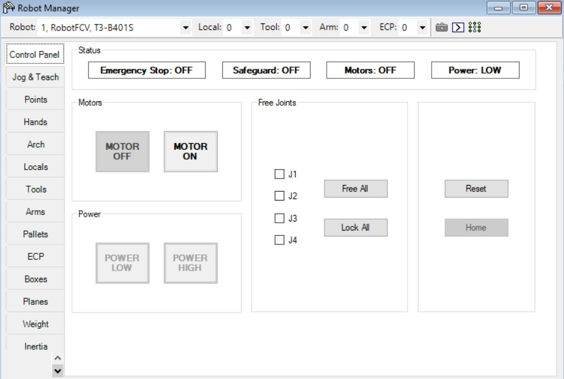
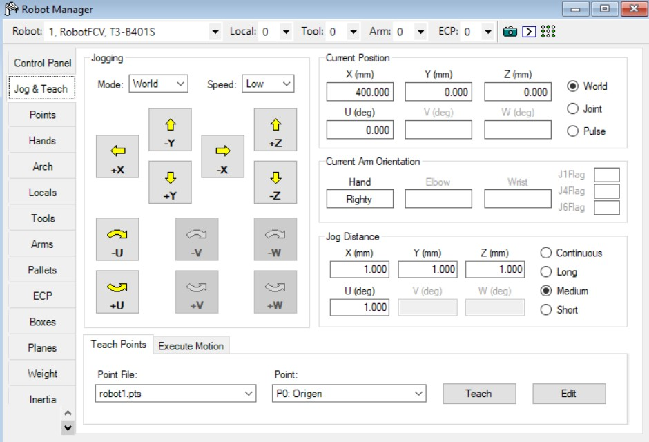
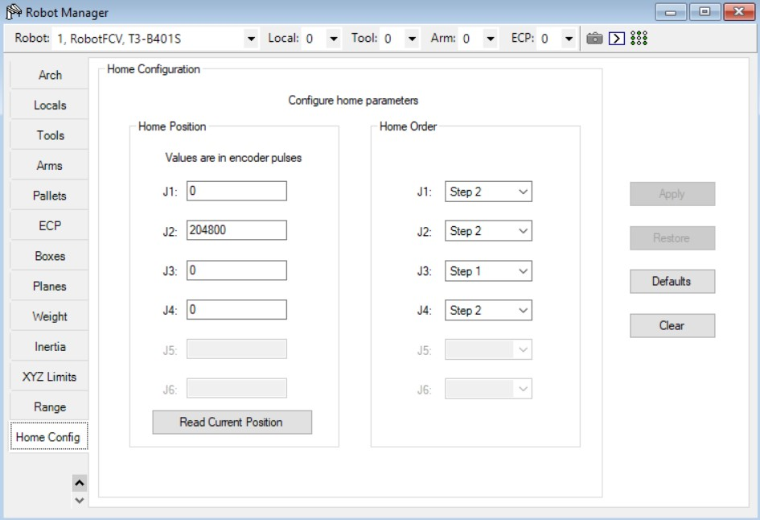
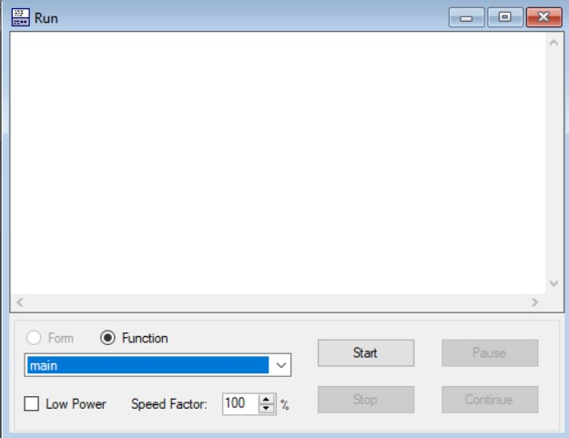
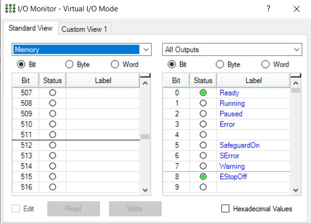

# Carlos Felipe Sánchez & Felipe Cruz
# Universidad Nacional de Colombia
# Robótica - 2023-II
# Laboratorio Epson (CDM)


# Contenido
En el repositorio de este laboratorio se encuentra lo siguiente:
- README.md -> Archivo base con la descripción del laboratorio.
- EpsonRC -> Carpeta que contiene el proyecto de Epson RC+ utilizado durante la práctica.
- Imgs -> Carpeta con imágenes utilizadas en el archivo README.
- Videos -> Carpeta con los videos resultantes del desarrollo de la práctica.

---
Tabla de Contenidos
---

- [1. Introducción](#1-introducción)
- [2. Programa en SPEL+](#2-programa-en-spel+)
- [3. Configuraciones preliminares](#3-configuraciones-preliminares)
- [4. Simulación del movimiento del robot en EpsonRC](#4-simulación-del-movimiento-del-robot-en-epsonrc)
- [5. Implementación en el robot real](#5-implementación-en-el-robot-real)

# 1. Introducción

# 2. Programa en SPEL+
Primero, definimos las funciones que se encargan de realizar los diferentes movimientos de paletizado (en forma de Z, en forma de S, y externo):
```
Function paletizadoZ
	Pallet 1, Origen, EjeY, EjeX, 2, 3
	Integer i
	For i = 1 To 6
		Jump Pallet(1, i)
	Next
Fend
Function paletizadoS
	Pallet 1, Origen, EjeY, EjeX, 2, 3
	Jump Pallet(1, 1)
	Jump Pallet(1, 2)
	Jump Pallet(1, 4)
	Jump Pallet(1, 3)
	Jump Pallet(1, 5)
	Jump Pallet(1, 6)
Fend
Function paletizadoExterno
	Pallet Outside, 2, Origen, EjeY, EjeX, 2, 3
	Integer i
	Integer j
	For i = 1 To 3
		For j = 1 To 4
			Jump Pallet(2, i, j)
		Next
	Next
Fend
```
Con el comando **Pallet** se define el espacio de trabajo con los puntos *Origen*, *EjeY* y *EjeX*, y se le coloca una grilla de 2x3. En cada función, se usa el comando **Jump** para mover el robot Scara, cuyo movimiento es el siguiente: primero, se mueve el efector final hacia arriba; luego, se mueve el efector final hasta la posición especificada; y finalmente, se baja el efector final hasta el plano de trabajo.

Luego, se utilizan las funciones dentro del código principal (main):
```
Function main
	Motor On
	Power High
	Accel 30, 30
	Speed 50
	Home
	Do
		If MemSw(512) Then
			Call paletizadoZ
			Home
		EndIf
		If MemSw(513) Then
			Call paletizadoS
			Home
		EndIf
		If MemSw(514) Then
			Call paletizadoExterno
			Home
		EndIf
	Loop
Fend
```
El código principal enciende el robot y define los parámetros de velocidad y aceleración máximos. Luego, se va al **Home**. Y finalmente, se llama cada una de las funciones de paletizado en base a la entrada digital que se active:
- Entrada 512 -> Paletizado en forma de Z
- Entrada 513 -> Paletizado en forma de S
- Entrada 514 -> Paletizado externo
Siempre se vuelve al **Home** después de realizar algún paletizado.

# 3. Procedimiento
A continuación, se presentan los pasos realizados durante la práctica.

0. Conectarse al robot virtual y ejecutar el código en simulación para verificar su buen funcionamiento.
1. Conectarse al robot físico mediante un cable USB con el software EpsonRC abierto.


*Fig3.1: Lugar en EpsonRC donde se selecciona la conexión al robot real o virtual.*

2. Definir manualmente los límites del espacio de trabajo.
3. Definir manualmente la posición de Home del robot.
4. Definir manualmente los 3 puntos del espacio de trabajo (Origen, EjeY, EjeX).



*Fig3.2: Dentro del RobotManager en el Control Panel se pueden liberar las articulaciones para que se puedan mover manualmente.*



*Fig3.3: Dentro del RobotManager en el Jog & Teach se pueden guardar los puntos de robot real, y controlar el robot si se enciende.*



*Fig3.4: Dentro del RobotManager en el Home Config se puede guardar/configurar la posición de Home del robot.*

5. Verificar los puntos definidos corriendo el comando **Jump**.
6. Ejecutar el código en el robot real con **Power Low** (por seguridad).
7. Ejecutar el código en el robot real con **Power High**.



*Fig3.5: Los códigos se pueden ejecutar desde el Run Window, que permite también definir la potencia y velocidad.*

Tanto para la simulación como para el robot real, se requiere de ejecutar el código desde el *Run Window*, y abrir el **I/O Monitor** para enviar las señales digitales que activan las funciones de paletizado.



*Fig3.6: El monitor I/O permite visualizar el estado de los bits (entrada o salida) y activar o desactivar bits de entrada.*

# 4. Simulación del movimiento del robot en EpsonRC
A continuación se presenta un video de la simulación virtual del proceso. Se activan las señales digitales en el siguiente orden:
1. Entrada 512 -> Paletizado en forma de Z
2. Entrada 513 -> Paletizado en forma de S
3. Entrada 514 -> Paletizado externo

# 5. Implementación en el robot real
A continuación se presenta un video del robot real realizando del proceso. Se activan las señales digitales en el siguiente orden:
1. Entrada 512 -> Paletizado en forma de Z
2. Entrada 513 -> Paletizado en forma de S
3. Entrada 514 -> Paletizado externo

